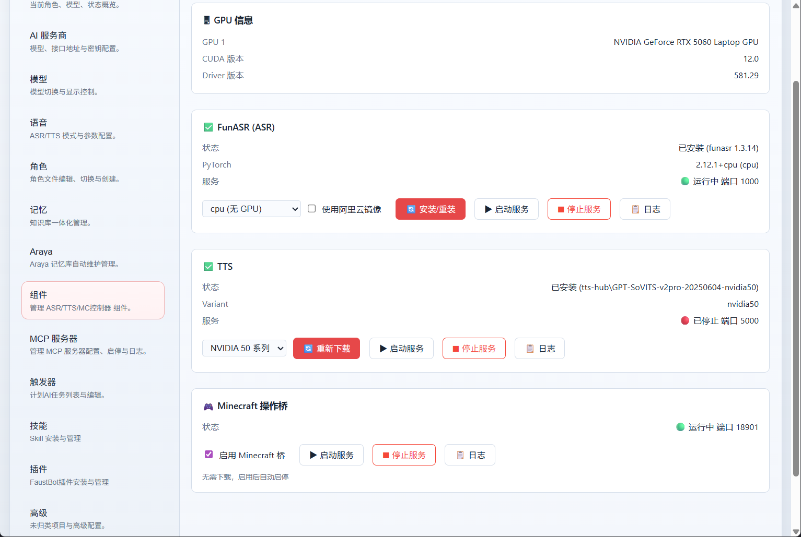

    

<h1 align="center">FaustBot</h1>

    <b>不只是会聊天的桌宠 —— 一个住在你桌面上、看得见你、能主动找你说话的 AI 伙伴。</b>

    🎉 <b>FaustBot 2.0 已发布！</b>

---

FaustBot 是一个 AI 驱动的 Vtuber / 桌面伙伴。她会用自己的声音唱歌、在你桌面上弹出小窗口和你玩游戏、留意你正在听什么歌或熬到多晚然后主动开口，还能替你上 B 站直播当主播。她记得住你说过的事，甚至会在你休息时自己整理这些记忆。她背后是一个真正的 Agent —— 会派活给子代理、会定时和按条件自己醒来干活、能读屏幕、开浏览器、进《我的世界》。

而这一切 —— 她的形象、声音、性格、能力 —— 全都由你来定义。

<!--
  图片占位：首屏主图（必需）
  文件名：docs/assets/hero.png（或 hero.gif，GIF 更佳）
  尺寸：建议宽 1000px 左右，16:9 或接近
  画面：桌面上的 Faust 形象 + 一条正在对话的字幕气泡，整体氛围要好看，用于定调
  要点：这是访客看到的第一眼，选最有代表性、最出片的一帧

    

-->

---

## ✨ 她能做什么

### 🎤 用她自己的音色唱歌（歌台 Song Studio）

点一首歌，FaustBot 会自动完成人声分离（UVR）与歌声转换（Seed-VC），用 **她自己的音色** 把这首歌唱给你听 —— 而不是简单地播放原曲。

<!--
  图片占位：AI 翻唱
  文件名：docs/assets/song-studio.png（或 .gif）
  画面：歌台界面正在点歌 / 转换进度 / 形象唱歌状态
  要点：突出"用她的声音唱"这件事，若能录 GIF 展示进度→播放最好

    

-->

### 🪟 她会现写一个小窗口和你玩（灵动窗口 Nimble Window）

FaustBot 可以在形象旁边弹出一个可拖动、可缩放的 HTML 小窗口和你实时互动。关键在于：这些窗口的内容 **由 AI 自己现场写出 HTML** 生成 —— 不是预置的模板。你可以让她即兴发挥，比如整一局"带炸弹的五子棋"这种没人会内置的玩法，她照样能当场造出来。窗口和 AI 之间双向通信，你在窗口里的每一步操作都能直接唤醒她。

<!--
  图片占位：灵动窗口
  文件名：docs/assets/nimble-window.png（或 .gif）
  画面：让 AI 即兴生成一个"带炸弹的五子棋"（或其他明显非内置的自定义玩法）小窗，和虚拟形象同框
  要点：用一个古怪、显然没人会预置的玩法，一眼体现"这是 AI 现场动态生成的 HTML"；GIF 展示下棋 + 触雷过程更佳

    

-->
### 👀 她知道你在干嘛，然后主动找你（Desktop Mood）

FaustBot 会在后台留意你的桌面情景 —— 通过 Windows SMTC 读取 **你正在听的歌**、你的前台窗口、是否熬到深夜、电量是否告急……然后主动做出反应：做个动作、开口和你聊两句、弹个便签提醒你。发现你在听歌时，她不会照本宣科念台词，而是把歌曲信息交给 AI 自由发挥。所有反应规则都可自定义。

<!--
  图片占位：Desktop Mood
  文件名：docs/assets/desktop-mood.png（或 .gif）
  画面：因为"检测到你在听歌 / 深夜 / 低电量"而主动说话的对话气泡瞬间
  要点：体现"她注意到了现实里发生的事并主动开口"，这是区别于普通聊天 Agent 的关键

    

-->

### 🧠 她会记住你，而且会自己整理记忆（长期记忆 + Araya 自动维护）

FaustBot 拥有一套基于图和生成树存储的三合一混合记忆系统 —— **语音向量语义检索 + BM25 关键词 + 知识图谱**，配合自动联想(BFS)与树状目录组织。你随口说过的事，她记得住、还能顺着关系联想起来。

真正特别的是：**记忆会自己长大、自己整理**。

- **写入即结构化**：每次记下新内容，后台都会自动从零散文字里抽取实体与关系、去重。
- **Araya 自动维护代理**：一个独立运行的记忆管家 Araya，会在你空闲时悄悄工作，把最近的记忆归纳成索引、清理重复条目、修剪冗余关系、计算重要性。你休息的时候，她在替你整理回忆。

<!--
  图片占位：长期记忆 / Araya
  文件名：docs/assets/memory.png（或 .gif）
  画面：记忆库/知识图谱可视化，或控制面板里的"记忆"与"Araya 记忆库自动维护"页面
  要点：体现"记忆有结构、会自动整理"，若能展示知识图谱节点关系或 Araya 维护日志更佳

    

-->
### 📺 让她替你上 B 站直播

FaustBot 内置 B 站直播接入，连上直播间即可接收弹幕并以直播模式实时回应，支持弹幕 / TTS 黑名单过滤。让她成为你自己的虚拟主播。

<!--
  图片占位：B 站直播
  文件名：docs/assets/live.png（或 .gif）
  画面：直播窗口 + 弹幕滚动 + 形象回应弹幕
  要点：展示"接弹幕 → 回应"的互动闭环

    

-->
### 🤖 一个能干活的真正 Agent，而不只是聊天机器人

FaustBot 的底层是基于 Langgraph 构建的代理,架构设计与主流Coding Agent接近：

- **Subagent 子代理**：她可以创建命名子代理、分配不同的工具权限和人设，把任务异步派出去，自己继续手头的事。
- **Trigger 触发器**：支持定时、周期、事件、甚至 **Python 条件表达式** 等多种触发方式，让她在合适的时机自己"醒来"干活。
- **多模态感知**：读屏幕、看摄像头、识别图片。
- **动手能力**：在线搜索、自动操作浏览器、读写编辑文件、玩《我的世界》（基于 Mineflayer，无缝体验）。
- **安全系统**：限制 Agent 的访问权限，并对模型下达的命令进行审核。

---

## 🧩 一切皆可定制

FaustBot 更像一个工作台 —— 从外观到灵魂，每一层都交给你来塑造：

- **🖼️ 低门槛自定义形象（Image 模式）**：不会 Live2D 建模也没关系。只要准备几张图片（基础立绘、表情、口型、点击反应图），就能拼出属于你自己的形象，零建模门槛地拥有一个专属桌宠。
- **🎭 多角色**：内置多套角色定义，每个角色都是一组可编辑的 Markdown 文件（人设、核心记忆、任务）；也可以从零创建你自己的角色。
- **🧩 插件系统 + 插件市场**：功能以插件形式扩展，配套插件市场一键安装、检查更新。
- **⚡ Skill 技能系统**：兼容 Openclaw Skill / ClawHub 技能格式，可从市场或 ZIP 安装。
- **🔌 MCP 客户端**：原生自带MCP客户端，接入海量 MCP 工具。
- **🗣️ TTS 声线定制**：基于 GPT-SoVITS，训练并切换属于你的角色声线。
- **🎨 Live2D / VRM 形象**：想要更立体显示的形象？同时支持 Live2D 与 VRM 两套体系，自由替换。

<!--
  图片占位：自定义（可复用现有控制面板截图）
  文件名：docs/assets/comp.png（已存在）或 Image 模式的立绘配置页截图
  画面：控制面板 / Image 模式形象配置界面
  要点：体现"高度可配置"，如果能补一张 Image 模式配图会更贴合上面第一条

    

-->
---

## 📋 完整功能清单

点击展开查看全部能力

### 感知

- [x] ASR 语音识别（本地 / 云端）
- [x] 多模态能力：读屏幕 / 摄像头 / 图片
- [x] Desktop Mood：感知系统媒体（SMTC）、空闲、窗口、电量、时段等桌面情景
- [x] 在线搜索，获取实时信息

### 记忆

- [x] 三合一混合长期记忆（向量语义 + BM25 关键词 + 知识图谱），带 2-hop 图谱联想与树状目录组织
- [x] 写入即自动抽取实体关系并去重，构建知识图谱
- [x] Araya 自动维护代理：空闲时自动归纳索引、去重、修剪图谱、打标签、写审计日志
- [x] 日记：Agent 主动记录、可被检索与自动整理

### 交互与输出

- [x] TTS 人声输出（本地 / 云端）
- [x] 音乐播放（唱歌）与歌曲翻唱（Seed-VC）
- [x] 灵动窗口：AI 现写 HTML 小窗口实时互动
- [x] B 站直播接入
- [x] 多角色支持

### Agent 工具

- [x] Subagent 子代理派发
- [x] Trigger 触发器（定时 / 周期 / 事件 / Python 条件）
- [x] 文件读写、编辑等基本能力
- [x] AI 自动操作浏览器
- [x] AI 玩《我的世界》（基于 Mineflayer）
- [x] MCP 客户端支持
- [x] 兼容 Openclaw Skill && ClawHub 技能
- [x] 安全系统：限制 Agent 访问权限并审核模型命令
- [x] 高效的工具实现

### 语音
- [x] Edge-TTS
- [x] GPT-Sovits
- [x] Whisper ASR
- [x] Funasr ASR
- [x] OpenAI ASR
- [x] OpenAI TTS
- [x] FaustBot Cloud Inference Server

---

## 🚀 快速开始

完整的安装与使用教程请前往官方文档：

FaustBot已经为Windows准备了安装包,无需折腾,一键开用

> [!WARNING]
> **使用前须知**
> 
> 本项目仅供技术参考和学习。不得使用本软件生成不符合法律法规的内容，否则后果自负。
> 
> 使用歌曲翻唱、B 站直播等功能时，所涉及的歌曲、直播内容等版权与合规责任由使用者自行承担。

    <a href="https://faustbot.allenlee.xyz"><b>📖 前往FaustBot文档站点 faustbot.allenlee.xyz</b></a>

---

## 技术实现

| 部分       | 实现                                  |
| -------- | ----------------------------------- |
| Backend  | Python 为主体，基于 LangChain / LangGraph |
| Frontend | Electron                            |

---

## Star History

---

## 贡献

请参见[CONTRIBUTING.md](CONTRIBUTING.md)

---

## 致谢

- 参考了 [morettt/my-neuro](https://github.com/morettt/my-neuro)（asr_api.py, ASR.bat, TTS.bat）
- TTS 基于 [RVC-Boss/GPT-SoVITS](https://github.com/RVC-Boss/GPT-SoVITS)
- 歌曲翻唱基于 [Plachtaa/seed-vc](https://github.com/Plachtaa/seed-vc)
- mc-operator 基于 [PrismarineJS/mineflayer](https://github.com/PrismarineJS/mineflayer)
- Agent 的部分工具与虚拟文件系统参考 [can1357/oh-my-pi](https://github.com/can1357/oh-my-pi)

---

## 关于角色

> 浮士德 （FAUST）是《边狱公司》及其衍生作品的登场角色。 原型来源歌剧 《浮士德》。 该罪人为我司巴士打造了“梅菲斯特号”引擎。 她声称自己是都市中最聪慧的存在，没有人能在智慧层面上与她相媲美，这可能并非谬论。 当她应允与您交谈时，您会发现她的态度高高在上，令人不悦。 她对待所有人都有一股微妙的傲慢态度，这似乎永远都无法改变了，因此，我们建议您只要应付一下，点点头就成。

角色设定来源于游戏《Limbus Company》，引用自[边狱公司中文维基](https://limbuscompany.huijiwiki.com/wiki/%E6%B5%AE%E5%A3%AB%E5%BE%B7)。

---

## 提示

live2d Cubsim Core的协议**并不**是GPLv3,它们是专有软件(Non-free Software)

## License
