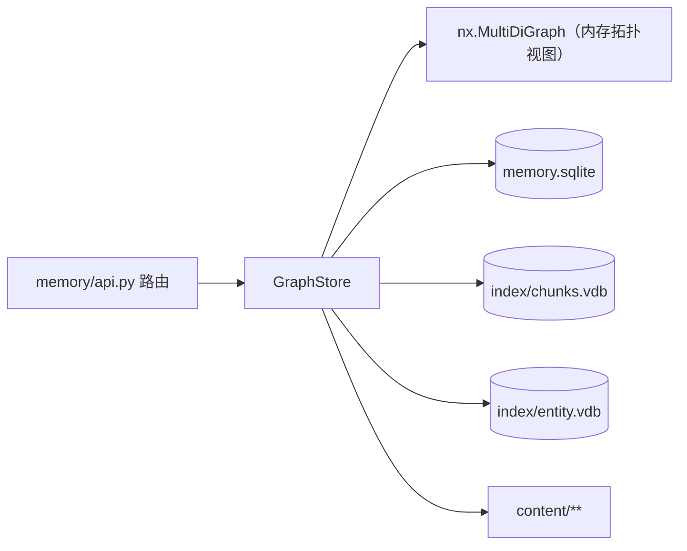

# Memory 存储布局

| 路径 | 内容 |
| --- | --- |
| `memory.sqlite` | 真源：`nodes` / `edges` / `tags` / `chunks` / `tasks`（WAL 模式） |
| `index/chunks.vdb` | nano-vectordb 分块向量（分块正文在 `chunks` 表） |
| `index/entity.vdb` | nano-vectordb 实体名向量（去重检索用） |
| `content/**` | 文档正文与附件（文件，不入库） |
| `_legacy_json/**` | 迁移前的旧 JSON 归档（可删除；删除后不可回滚） |

## 不变量

- `nodes.parent_id` 是「两个 path 节点之间 `has_child` 关系」的唯一真源；`edges` 表存其余所有关系。
- 时间列统一 UTC epoch（`REAL`），对外输出仍是 `%Y-%m-%dT%H:%M:%SZ` 字符串。
- 单连接 + `threading.RLock` + 可重入事务（`MemoryDB.transaction()`）；`nx` 是 SQL 的内存投影，进程崩溃后可由 SQL 完整重建。
- `_write_lock` 是跨事件循环、跨线程的异步互斥锁（`GraphStore` 的协程会在 `asyncio.run`、插件 `_run_sync`、`_run_async_in_thread` 等多个循环里被调用，`asyncio.Lock` 跨循环争用会直接抛错）。

## 自动迁移

首次启动若存在 `graph.json` 且 `nodes` 表为空 → 单事务导入 + 校验 + 归档旧文件；校验失败会抛错并保持旧文件不动（不静默降级）。

真实旧库里存在「meta 文件比图节点多」的孤儿元数据（本机 `faust` 数据有 162 例，附带 157 条孤儿分块）：`graph.json` 是树形状的真源，孤儿 meta 与孤儿分块被跳过并计入 `MigrationReport.counts["orphan_meta"]`（逐条 `WARNING` 日志），不会让整次迁移失败。

## 回滚

1. 停止后端；
2. 删除 `memory/memory.sqlite`、`memory/memory.sqlite-wal`、`memory/memory.sqlite-shm`；
3. 把 `memory/_legacy_json/` 下的内容移回原位（`graph.json` 回 `memory/`，`index/entity_vecs.jsonl` 回 `memory/index/`，`meta/` 回 `memory/meta/`）；
4. 删除 `memory/index/entity.vdb`；
5. 切回迁移前的代码版本，启动。
