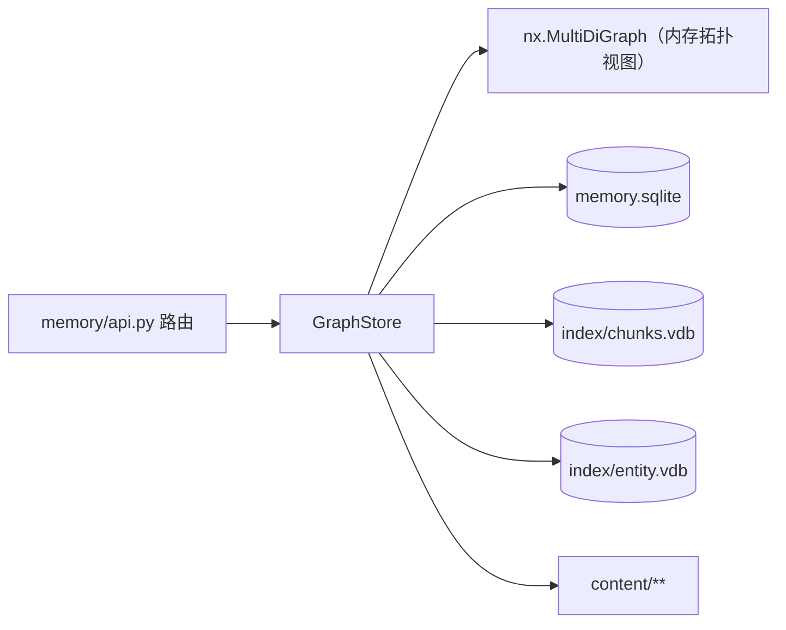

# Memory 存储布局

| 路径 | 内容 |
| --- | --- |
| `memory.sqlite` | `nodes` / `edges` / `tags` / `chunks` / `tasks`（WAL 模式） |
| `index/chunks.vdb` | nano-vectordb 分块向量（分块正文在 `chunks` 表） |
| `index/entity.vdb` | nano-vectordb 实体名向量（去重检索用） |
| `content/**` | 文档正文与附件（文件） |
| `_legacy_json/**` | 迁移前的旧 JSON 归档（可删除；删除后不可回滚） |

## 回滚

1. 停止后端；
2. 删除 `memory/memory.sqlite`、`memory/memory.sqlite-wal`、`memory/memory.sqlite-shm`；
3. 把 `memory/_legacy_json/` 下的内容移回原位（`graph.json` 回 `memory/`，`index/entity_vecs.jsonl` 回 `memory/index/`，`meta/` 回 `memory/meta/`）；
4. 删除 `memory/index/entity.vdb`；
5. 切回迁移前的代码版本，启动。
