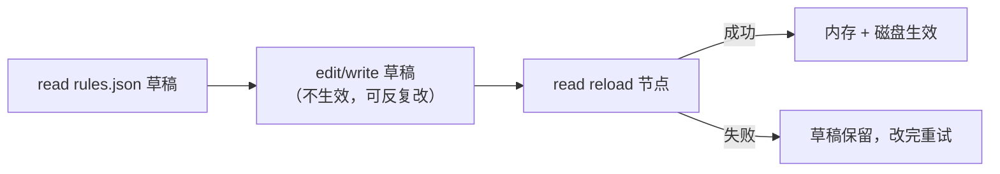

# 桌面心情规则引擎（Desktop Mood Rules）

本技能指导你编辑 **desktop-mood 插件的情景规则**：规则让 Faust 在桌面环境满足条件时自动动作（做动作/说话/弹便签/唤醒自己）。当用户说“我打游戏时提醒我喝水”“深夜别老提醒我”“关掉那个 CPU 报警规则”时使用本技能。

## 三个 VFS 节点

| 节点 | 类型 | 作用 |
|---|---|---|
| `faustbot://plugins/desktop-mood/rules.json` | 草稿（可写） | 当前规则草稿。`write`/`edit` **只改草稿，不生效、不落盘** |
| `faustbot://plugins/desktop-mood/reload` | 提交（读/写皆可） | **`read` 一次**即提交草稿；`write` 效果相同，写入内容被忽略 |
| `faustbot://plugins/desktop-mood/rules.md` | 指南（只读） | 本工作流摘要 + 当前生效规则清单 |
| `faustbot://plugins/desktop-context.json` | 快照（只读） | 实时桌面环境（窗口/进程/空闲/电量/媒体/天气），写规则前先读它确认信号是否存在 |



## 工作流（必须遵守）

1. `read("faustbot://plugins/desktop-mood/rules.json")` 看当前草稿（JSON 数组）。
2. 用 `edit` 精确增删改草稿内容（`write` 整体覆盖也可以，但**必须给出完整数组**）。
3. `read("faustbot://plugins/desktop-mood/reload")` 提交。返回三段式结果：
   - 成功：
     ```
     Desktop Mood 规则提交: 成功
     生效规则: 9 条
     草稿与生效: 已同步（本次提交: 有改动）
     ```
     末尾标注 `有改动` / `无改动`（相对上一次提交），可判断本次是否真的改了规则。
   - 失败：
     ```
     Desktop Mood 规则提交: 失败
     原因: 规则 #3 (xxx): condition.type 非法: "not_exist"（支持: ...）
     生效规则: 9 条(未变更)
     草稿: 保留未提交
     ```
4. 失败时按“原因”修草稿，再读一次 reload。

## 规则 schema

```json
{
  "id": "unique_snake_id",
  "label": "人类可读名称",
  "enabled": true,
  "cooldown_sec": 1800,
  "kind": "speech",
  "condition": {"type": "idle_over", "seconds": 600},
  "action": {"speech": "你很久没说话了。"}
}
```

| 字段 | 必填 | 说明 |
|---|---|---|
| `id` | ✅ | 唯一字符串（重复会被提交拒绝） |
| `label` | | 展示名，前端面板可见 |
| `enabled` | | 默认 `true`；`false` 时规则保留但不触发（停用规则首选这种做法） |
| `cooldown_sec` | | 该规则两次触发的最小间隔，默认 `1800`。**这是控制触发频率的主要手段** |
| `kind` | ✅ | `motion` / `speech` / `nimble` / `event-trigger` |
| `condition` | ✅ | 触发条件，见下表 |
| `action` | ✅ | 动作，随 `kind` 变化 |

### condition.type

| type | 参数 | 命中条件 |
|---|---|---|
| `idle_over` | `seconds` | 用户空闲 ≥ seconds 秒 |
| `return_active` | — | 用户从空闲回到活动的**边沿**（刚回来那一瞬） |
| `cpu_over` | `value` | CPU 使用率 ≥ value（百分数） |
| `memory_over` | `value` | 内存使用率 ≥ value（百分数） |
| `battery_under` | `value` | 电量 ≤ value 且**未充电** |
| `hour_range` | `start`, `end` | 小时数在 [start, end] 闭区间内（如 2~5 表示凌晨） |
| `window_contains` | `value` | 前台窗口标题包含 value（大小写不敏感） |
| `smtc_playing` | — | 系统媒体**开始播放**的上升沿 |

任意 condition 还可附加 `"probability": 0.2`：条件命中后再过一道概率（0~1），用于降低频繁环境的打扰。

### action（按 kind）

| kind | action 字段 | 效果 |
|---|---|---|
| `motion` | `motion`（动作名，必填） | 前端播放动作，如 `yawn` |
| `speech` | `speech`（必填） | 直接说这句话 |
| `nimble` | `note`（必填）、`title` | 弹出便签窗口 |
| `event-trigger` | `event_name`、`summary` | 创建一个 event 触发器唤醒你自己（payload 含当时的 context 与 rule） |

`speech` / `note` / `summary` 支持模板占位：`{hour}`（当前小时）、`{battery}`（电量百分比）。

## 引擎行为（写规则时要考虑的）

- 心跳（heartbeat）里按数组顺序遍历规则，**只执行第一条**命中且冷却已过的规则，然后本轮结束。
- 除每条规则的 `cooldown_sec` 外，还有全局冷却 `GLOBAL_COOLDOWN_SEC`（默认 180 秒）限制任意规则触发频率。
- 规则数组顺序 = 优先级，把更重要的规则放前面。

## 示例

用户打游戏时提醒喝水（窗口进程名可从 desktop-context.json 的 `window_process` 观察）：

```json
{
  "id": "gaming_hydrate",
  "label": "游戏提醒喝水",
  "enabled": true,
  "cooldown_sec": 3600,
  "kind": "speech",
  "condition": {"type": "window_contains", "value": "GenshinImpact", "probability": 0.15},
  "action": {"speech": "打了 {hour} 点了，喝口水吧。"}
}
```

深夜且空闲时静默一下（用 `enabled:false` 停用已有规则，而不是删掉）：

```json
{"id": "night_owl", "label": "深夜活动提醒", "enabled": false, "cooldown_sec": 1800, "kind": "speech", "condition": {"type": "hour_range", "start": 2, "end": 5}, "action": {"speech": "凌晨 {hour} 点了，还不睡吗。"}}
```

## 红线

- **不要直接改 `~/.faustbot/desktop-mood.rules.json`**：该文件由 reload 提交动作写入，直接改它需要外部手段且不会被引擎感知；一律走草稿节点。
- 草稿必须是**合法 JSON 数组**，且通过提交校验（`id` 唯一非空、`kind` 与 `condition.type` 合法、动作字段配套）；提交失败不会破坏已生效规则。
- `edit` 草稿时 `old_str` 要唯一，否则会被拒绝——多行片段请带上下文；不确定就先 `read`。
- 一次提交即生效，无需重启插件；用户手动改过磁盘文件后让插件重读时才需要重启/热重载。
- 删除规则用 `enabled: false`；确实要删就从数组中移除该对象。
