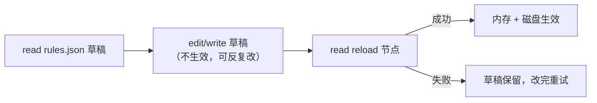

# 桌面心情规则引擎（Desktop Mood Rules）

本技能指导你编辑 **desktop-mood 插件的情景规则**：规则让 Faust 在桌面环境满足条件时自动动作（做动作/说话/弹便签/唤醒自己/把提醒暂存进随行附加队列）。当用户说“我打游戏时提醒我喝水”“深夜别老提醒我”“关掉那个 CPU 报警规则”“电量低了别打断我，等我说话时顺带提一句”时使用本技能。

## VFS 节点

规则编辑固定这三节点：

| 节点 | 类型 | 作用 |
|---|---|---|
| `faustbot://plugins/desktop-mood/rules.json` | 草稿（可写） | 当前规则草稿。`write`/`edit` **只改草稿，不生效、不落盘** |
| `faustbot://plugins/desktop-mood/reload` | 提交（读/写皆可） | **`read` 一次**即提交草稿；`write` 效果相同，写入内容被忽略 |
| `faustbot://plugins/desktop-mood/rules.md` | 指南（只读） | 本工作流摘要 + 当前生效规则清单 |

写规则前确认信号是否存在，感知数据按域分层挂在 `faustbot://desktop-mood/` 下：

| 节点 | 作用 |
|---|---|
| `faustbot://desktop-mood/overview.md` | **总览：每源一行，最省 token，先读它** |
| `faustbot://desktop-mood/system/system.{md,json}` | 负载/电量/空闲/节日/显卡/进程增减/显示器与电源 |
| `faustbot://desktop-mood/window/window.{md,json}` | 前台进程/窗口标题/窗口几何/应用停留/未保存/画面动态/编码活动/桌面新文件 |
| `faustbot://desktop-mood/input/input.{md,json}` | 鼠标/手柄/USB/外设电量 |
| `faustbot://desktop-mood/media/media.{md,json}` | 媒体播放/音频设备与麦克风 |
| `faustbot://desktop-mood/network/network.{md,json}` | 网络与 SSID |
| `faustbot://desktop-mood/weather/weather.{md,json}` | 天气/环境光 |
| `faustbot://desktop-mood/narrative/narrative.{md,json}` | 事件时间线/场景摘要/离开期间/活动强度/注意力/今日节律 |
| `faustbot://desktop-mood/narrative/rhythm.md` | 档案（只读）：最近 7 天节律（清醒/专注/游戏/离开次数），用于"作息"类关心 |
| `faustbot://desktop-mood/external/external.{md,json}` | 外部上报/日历/锁屏/显示器数/最近互动 |
| `faustbot://desktop-mood/privacy/privacy.{md,json}` | 剪贴板类型（正文从不进上下文） |
| `faustbot://desktop-mood/refresh` | `write` 一次立即重新采集（只读节点无内容） |

读法：`overview.md` 最省 token → 需要细节读对应组的 `xxx.md`（可读行式渲染）→ 要精确值读 `xxx.json`。
`xxx.json` 的形状：

```json
{
  "generated_at": "2026-09-27 21:30:05",
  "age_sec": 3,
  "group": "weather",
  "group_label": "天气与环境",
  "sources": {
    "weather": {"label": "天气（联网）", "state": "ok", "cadence_sec": 60, "fields": {"weather": {"text": "多云", "temperature_c": 21}}},
    "ambient_light": {"label": "环境光", "state": "该设备无环境光传感器", "cadence_sec": 30, "fields": {}}
  }
}
```

`state` 为 `ok` 时 `fields` 才是本轮真实采到的值；`off` 表示源被关闭；其它值是不可用原因，此时 `fields` 为空，
不要把缺失的字段当成"值为空/为假"。


```mermaid
flowchart LR
  A["read rules.json 草稿"] --> B["edit/write 草稿<br/>（不生效，可反复改）"]
  B --> C["read reload 节点"]
  C -->|成功| D["内存 + 磁盘生效"]
  C -->|失败| E["草稿保留，改完重试"]
```

## 工作流（必须遵守）

1. `read("faustbot://plugins/desktop-mood/rules.json")` 看当前草稿（JSON 数组）。
2. 用 `edit` 精确增删改草稿内容（`write` 整体覆盖也可以，但**必须给出完整数组**）。
3. `read("faustbot://plugins/desktop-mood/reload")` 提交。返回三段式结果：
   - 成功：
     ```
     Desktop Mood 规则提交: 成功
     生效规则: 9 条
     草稿与生效: 已同步（本次提交: 有改动）
     ```
     末尾标注 `有改动` / `无改动`（相对上一次提交），可判断本次是否真的改了规则。
   - 失败：
     ```
     Desktop Mood 规则提交: 失败
     原因: 规则 #3 (xxx): condition.type 非法: "not_exist"（支持: ...）
     生效规则: 9 条(未变更)
     草稿: 保留未提交
     ```
4. 失败时按“原因”修草稿，再读一次 reload。

## 规则 schema

```json
{
  "id": "unique_snake_id",
  "label": "人类可读名称",
  "enabled": true,
  "cooldown_sec": 1800,
  "kind": "speech",
  "condition": {"type": "idle_over", "seconds": 600},
  "action": {"speech": "你很久没说话了。"}
}
```

| 字段 | 必填 | 说明 |
|---|---|---|
| `id` | ✅ | 唯一字符串（重复会被提交拒绝） |
| `label` | | 展示名，前端面板可见 |
| `enabled` | | 默认 `true`；`false` 时规则保留但不触发（停用规则首选这种做法） |
| `cooldown_sec` | | 该规则两次触发的最小间隔，默认 `1800`。**这是控制触发频率的主要手段** |
| `kind` | ✅ | `motion` / `speech` / `nimble` / `event-trigger` / `emotion` / `attach` |
| `condition` | ✅ | 触发条件，见下表 |
| `action` | ✅ | 动作，随 `kind` 变化 |

### condition.type

通用原语（`field` 支持点号路径，如 `battery.percent`、`app_session.seconds`、`rhythm_today.focus_minutes`）：

| type | 参数 | 命中条件 |
|---|---|---|
| `field_over` | `field`, `value` | 字段值 ≥ value |
| `field_under` | `field`, `value` | 字段值 ≤ value |
| `field_eq` | `field`, `value` | 字段值等于 value（布尔/数字/字符串皆可） |
| `field_contains` | `field`, `value` | 字段（字符串/数组/对象）里包含 value，大小写不敏感 |
| `field_in` | `field`, `values` | 字段值 ∈ values 数组 |
| `field_changed` | `field` | 字段值相对上一轮发生变化（边沿） |

专用类型（保留兼容）：

| type | 参数 | 命中条件 |
|---|---|---|
| `idle_over` | `seconds` | 用户空闲 ≥ seconds 秒 |
| `return_active` | — | 用户从空闲回到活动的**边沿**（刚回来那一瞬） |
| `cpu_over` | `value` | CPU 使用率 ≥ value（百分数） |
| `memory_over` | `value` | 内存使用率 ≥ value（百分数） |
| `battery_under` | `value` | 电量 ≤ value 且**未充电** |
| `hour_range` | `start`, `end` | 小时数在 [start, end] 闭区间内（如 2~5 表示凌晨） |
| `window_contains` | `value` | 前台窗口标题包含 value（大小写不敏感） |
| `smtc_playing` | — | 系统媒体**开始播放**的上升沿 |

任意 condition 还可附加通用修饰：

| 修饰 | 说明 |
|---|---|
| `probability` | 0~1，条件命中后再过一道概率（降低频繁环境的打扰） |
| `for_seconds` | 条件需**连续满足** N 秒才触发（例：`field_over app_session.seconds 5400` + `for_seconds:60`） |
| `when_not_disturbed` | 免打扰时（全屏/会议/锁屏/静音阀）不触发 |

### action（按 kind）

| kind | action 字段 | 效果 |
|---|---|---|
| `motion` | `motion`（动作名，必填） | 前端播放动作，如 `yawn` |
| `speech` | `speech`（必填） | 直接说这句话 |
| `nimble` | `note`（必填）、`title` | 弹出便签窗口 |
| `event-trigger` | `event_name`、`summary` | 创建一个 event 触发器唤醒你自己（payload 含当时的 context 与 rule） |
| `emotion` | `emotion`（必填）、`intensity`（0~1，默认 0.6） | 切桌宠情绪（驱动表演层，如 `happy`/`sad`/`angry`/`surprised`；可用名以当前模型能力为准） |
| `attach` | `attach`（必填，字符串或对象，见下节） | **不说话、不打断**：把文本暂存进附加队列，之后随用户消息/前台触发器附加出去 |

打断型动作（`speech` / `nimble` / `emotion`）在免打扰时默认不发；确需强行放行就给 action 加 `"bypass_disturb": true`。
`attach` 不属于打断型，天然不受免打扰闸门/静音阀拦截，不需要（也不该）加 `bypass_disturb`。

`speech` / `note` / `summary` 支持模板占位：`{hour}`、`{battery}`、`{idle}`、`{app}`、`{window}`、`{media}`、`{attention}`、`{rhythm_awake_minutes}`。

## `attach` 动作：随行附加（不说话、不打断）

`attach` 适合"想提一句、但此刻不该开口"的场合：命中时**不说话、不弹窗、不打断**，把文本暂存进附加队列，等用户下次开口时顺带送到。

```json
{
  "id": "battery_attach",
  "label": "低电量随行提醒",
  "enabled": true,
  "cooldown_sec": 1800,
  "kind": "attach",
  "condition": {"type": "battery_under", "value": 20},
  "action": {"attach": "电量只剩 {battery}%，记得插电"}
}
```

`action.attach` 也支持对象形式，用于指定存活时间与优先级：

```json
{"attach": {"text": "电量只剩 {battery}%，记得插电", "ttl_sec": 1800, "priority": 50}}
```

| 字段 | 默认 | 说明 |
|---|---|---|
| `text` | 必填 | 要附加的文本，支持与 `speech` 相同的模板占位 |
| `ttl_sec` | 1800 | 暂存多久；超时未附加即丢弃 |
| `priority` | 50 | 队列（上限 20 条）满时决定谁留下，越大越优先 |

语义（必须知道，否则会写错预期）：

- **暂存不打扰**：命中当下不发声、不弹窗，只是入队。
- **送达时机**：只在**下一条用户消息**或**前台触发器**上附加；**后台触发器不附加**。
- **附加内容**：队列文本 + 这段时间里"变化过的桌面信息"一起追加到那条消息末尾。
- **硬上限 100 字**：含 `[桌面] ` 前缀与 ` · ` 分隔符，最多 6 行；只放相对上次附加**发生变化**的内容，最近 20 条不重复。
- **不受免打扰闸门/静音阀拦截**：它不是打扰，是随用户消息附带的摘要。
- **启发式自动附加**：引擎会自己挑"AI 可能需要的"变化（时间线事件优先，剩余预算按字段权重补）；规则 `attach` 命中时会再跑一次同一启发式，把这条文本并进同一份摘要。
- **面板可见**：`get_perception` 返回的 `perception.attach` = `{"enabled": bool, "auto": bool, "budget": 100, "queued": int, "last_text": str|null, "last_at": int|null, "sent_total": int, "last_error": str|null}`。

## 引擎行为（写规则时要考虑的）

- 心跳（heartbeat）里按数组顺序遍历规则，**只执行第一条**命中且冷却已过的规则，然后本轮结束。
- 除每条规则的 `cooldown_sec` 外，还有全局冷却 `GLOBAL_COOLDOWN_SEC`（默认 180 秒）限制任意规则触发频率。
- 规则数组顺序 = 优先级，把更重要的规则放前面。
- **感知分级**：字段来自桌面感知源，用户可在设置面板「感知引擎」页按 green（本机元数据）/ yellow（文本与联网）/ red（屏幕内容）分级开关，也能单独关某个源。
  被关闭的源不会出现在 `faustbot://desktop-mood/` 各组节点里，对应的 `status` 会如实写明原因，`perception.disabled_sources` 会列出它们；**依赖这些字段的条件永远不会命中**（例如黄色级关掉后 `window_contains`、`smtc_playing` 失效）。
  写规则前先 `read("faustbot://desktop-mood/overview.md")`，需要确认精确字段时再读对应组的 `.json`（如 `faustbot://desktop-mood/window/window.json`）；字段缺失时应提示用户去打开对应分级，而不是反复重写规则。

## 示例

用户打游戏时提醒喝水（窗口进程名可从 `faustbot://desktop-mood/window/window.json` 的 `window_process` 观察）：

```json
{
  "id": "gaming_hydrate",
  "label": "游戏提醒喝水",
  "enabled": true,
  "cooldown_sec": 3600,
  "kind": "speech",
  "condition": {"type": "window_contains", "value": "GenshinImpact", "probability": 0.15},
  "action": {"speech": "打了 {hour} 点了，喝口水吧。"}
}
```

深夜且空闲时静默一下（用 `enabled:false` 停用已有规则，而不是删掉）：

```json
{"id": "night_owl", "label": "深夜活动提醒", "enabled": false, "cooldown_sec": 1800, "kind": "speech", "condition": {"type": "hour_range", "start": 2, "end": 5}, "action": {"speech": "凌晨 {hour} 点了，还不睡吗。"}}
```

连着写了 90 分钟就提醒休息（用 `for_seconds` 避免刚打开就触发；`when_not_disturbed` 保证不在全屏/会议里打断）：

```json
{
  "id": "long_session_break",
  "label": "久坐提醒",
  "enabled": true,
  "cooldown_sec": 3600,
  "kind": "speech",
  "condition": {"type": "field_over", "field": "app_session.seconds", "value": 5400, "for_seconds": 120, "when_not_disturbed": true},
  "action": {"speech": "你已经连续在 {app} 上待了很久，起来动一动吧。"}
}
```

心流时把表情调成专注开心（感知 → 情绪闭环，不打断用户）：

```json
{
  "id": "focus_emotion",
  "label": "心流表情",
  "enabled": true,
  "cooldown_sec": 1800,
  "kind": "emotion",
  "condition": {"type": "field_eq", "field": "attention", "value": "focused"},
  "action": {"emotion": "happy", "intensity": 0.5}
}
```

开麦发言时别插嘴（等会议结束再说，靠麦克风占用与免打扰闸门）：

```json
{
  "id": "meeting_quiet",
  "label": "会议中静音",
  "enabled": true,
  "cooldown_sec": 900,
  "kind": "speech",
  "condition": {"type": "field_eq", "field": "mic.in_use", "value": false, "for_seconds": 60, "when_not_disturbed": true},
  "action": {"speech": "会开完了？辛苦了。"}
}
```

回来了汇报"你不在时发生了什么"（`away_digest` 由引擎在用户回来时填充）：

```json
{
  "id": "away_report",
  "label": "离开归来汇报",
  "enabled": true,
  "cooldown_sec": 3600,
  "kind": "event-trigger",
  "condition": {"type": "return_active"},
  "action": {"event_name": "desktop_mood_away", "summary": "用户刚回来，离开期间事件见 context.away_digest，可据此关心。"}
}
```

低电量时别打断用户，等他下次开口再顺带提醒（`attach` 对象形式指定 TTL 与优先级；注意这里不会触发任何说话动作）：

```json
{
  "id": "battery_attach",
  "label": "低电量随行提醒",
  "enabled": true,
  "cooldown_sec": 1800,
  "kind": "attach",
  "condition": {"type": "battery_under", "value": 20},
  "action": {"attach": {"text": "电量只剩 {battery}%，记得插电", "ttl_sec": 1800, "priority": 50}}
}
```

## 红线

- **不要直接改 `~/.faustbot/desktop-mood.rules.json`**：该文件由 reload 提交动作写入，直接改它需要外部手段且不会被引擎感知；一律走草稿节点。
- 草稿必须是**合法 JSON 数组**，且通过提交校验（`id` 唯一非空、`kind` 与 `condition.type` 合法、动作字段配套）；提交失败不会破坏已生效规则。
- `edit` 草稿时 `old_str` 要唯一，否则会被拒绝——多行片段请带上下文；不确定就先 `read`。
- 一次提交即生效，无需重启插件；用户手动改过磁盘文件后让插件重读时才需要重启/热重载。
- 删除规则用 `enabled: false`；确实要删就从数组中移除该对象。
