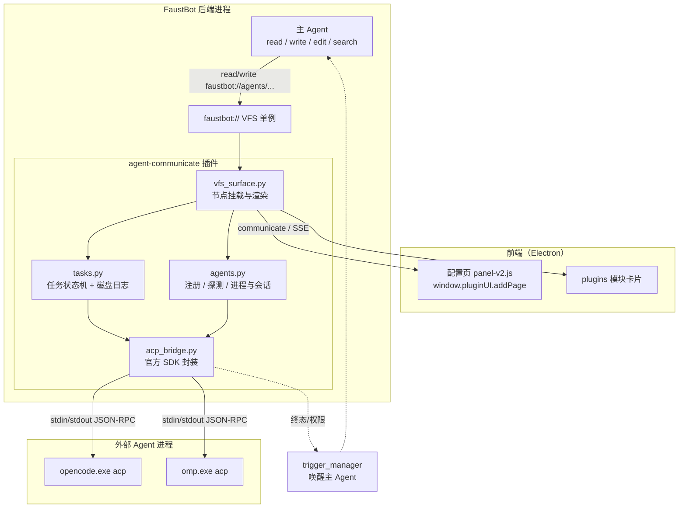
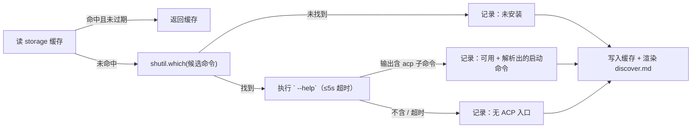
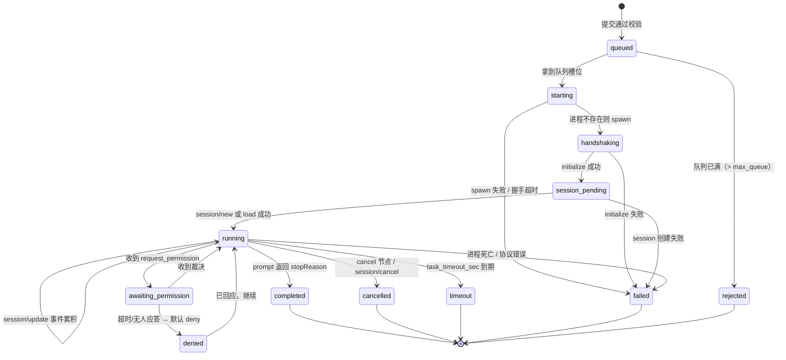
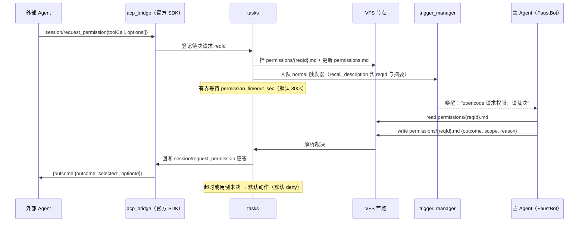

# Agent-Communicate 插件规格说明书

| 项目     | 内容                                                                                                |
| ------ | ------------------------------------------------------------------------------------------------- |
| 文档状态   | 待评审（Spec，未实施）                                                                                     |
| 目标插件   | `agent-communicate`（FaustBot 内置插件）                                                                |
| 协议范围   | ACP（Agent Client Protocol）· v1 做客户端调用方                                                            |
| 协议实现   | **ACP 官方 Python SDK**：`agent-client-protocol` **0.12.1**（跟踪 ACP schema `v1.19.0`），不自研 JSON-RPC 层  |
| 事实基线   | opencode 1.18.27（ACP `protocolVersion: 1`）、omp / Oh My Pi 18.2.1、`.runtime` Python 3.11.9、Windows |
| 唯一新增依赖 | `agent-client-protocol==0.12.1`（传递依赖仅 `pydantic>=2.7`，仓库已有）                                       |
| 依据     | 对 `opencode acp` / `omp acp` 的真实握手实测 + SDK wheel 实体解包核读 + 仓库源码通读（见附录 B）                           |

---

## 1. 背景与目标

FaustBot 目前只能调用**自己**的 Subagent（`faustbot://subagents/`）。本规格定义一个插件，让 FaustBot 作为 **ACP 客户端**去调用外部编码 Agent（本机已装 opencode 与 omp），并遵守仓库的 **VFS 优先**原则：**不新增任何 Agent 工具**，全部能力通过 `read` / `write` / `edit` 操作 `faustbot://agents/` 暴露。

### 1.1 目标

1. FaustBot 能通过 VFS 提交任务给外部 Agent，并取回结果与事件流。
2. 异步语义：提交立即返回 task id，**绝不阻塞 agent turn**。
3. 会话可续：复用 ACP session，支持续接历史会话。
4. 权限可控：外部 Agent 的权限请求升级给主 Agent 决策，并有超时兜底。
5. 自动发现：插件启动时识别 PATH 上的 `opencode acp` / `omp acp` 并自动注册。
6. 附带一个 SKILL 与一个前端配置页。
7. **协议层不自研**：使用 ACP 官方 Python SDK，进程 spawn、stdio 帧、请求-应答配对、超时、类型校验全部交给 SDK；本插件只写业务（任务、权限、VFS）。

### 1.2 非目标（v1 明确不做）

| 不做                                         | 原因                                       |
| ------------------------------------------ | ---------------------------------------- |
| A2A 协议（远程 HTTP Agent）                      | 内部抽 transport 接口预留，v1 不做                 |
| `terminal/*` 客户端能力                         | 不声明即可；opencode 用自己的 shell，实现 PTY 只会增加卡死面 |
| `fs/read_text_file` / `fs/write_text_file` | 见 §7.3：子进程本就拥有用户权限，声明它**不能**形成沙箱，只增加一层透传 |
| `elicitation/create`（Agent 反向提问用户）         | 属 unstable 特性且需声明能力；v1 不做（见 §7.6）        |
| `session/fork`                             | 尚无明确使用时机，容易误用                            |
| MCP server 注入（`mcpServers` 参数）             | 仓库已有 `McpManager` 覆盖 MCP 场景              |
| 把外部 Agent 的工具映射成 FaustBot 工具               | 违反"不新增工具"原则                              |
| 修改 `priority="interrupt"` 的行为              | 属全局触发器语义变更，超出插件范围（仅修文档，见 §7.3）           |

---

## 2. 术语

| 术语                       | 含义                                               |
| ------------------------ | ------------------------------------------------ |
| 外部 Agent / 远端 Agent      | 通过 ACP 被调用的进程，如 opencode、omp                     |
| Client                   | ACP 客户端，即本插件（运行在 FaustBot 后端进程内）                 |
| 信封（envelope）             | FaustBot 写入 `submit` 节点的任务描述 JSON                |
| ACK                      | write/edit handler 的返回字符串，经 core 透传追加到工具输出       |
| 任务（task）                 | 一次 `session/prompt` 的完整生命周期                      |
| 权限请求（permission request） | 外部 Agent 通过 `session/request_permission` 发起的裁决请求 |

---

## 3. ACP 事实基线（实测，非推测）

以下均为对真实进程的实测结果，是全部实现的依据。

### 3.1 `initialize` 应答

```json
{"protocolVersion": 1,
 "agentInfo": {"name": "OpenCode", "version": "1.18.27"},
 "authMethods": [{"id": "opencode-login", "name": "Login with opencode",
                  "description": "Run `opencode auth login` in the terminal"}],
 "agentCapabilities": {
   "loadSession": true,
   "promptCapabilities": {"embeddedContext": true, "image": true},
   "sessionCapabilities": {"list": {}, "fork": {}, "resume": {}, "close": {}},
   "mcpCapabilities": {"http": true, "sse": true}}}
```

omp 的应答结构一致（`agentInfo.name = "oh-my-pi"`，`authMethods[0].id = "agent"`）。

### 3.2 实测确认的方法

| 方法                           | 实测结果                                                                 |
| ---------------------------- | -------------------------------------------------------------------- |
| `initialize`                 | ✅ 返回上述结构                                                             |
| `session/new`                | ✅ 返回 `{sessionId, configOptions}`；**无需先 authenticate**               |
| `session/list`               | ✅ 返回历史会话 `{sessionId, cwd, title, updatedAt}`（本机 18 条）               |
| `session/set_config_option`  | ✅ 形状 `{sessionId, configId, value, type:false}`，返回完整 `configOptions` |
| `session/close`              | ✅ 返回 `{}`                                                            |
| `session/update`             | ✅ 会话建立后推送 `available_commands_update`                                |
| `session/prompt`             | ⚠️ 未实测（需真实 LLM 调用），形状取自 ACP 规范                                       |
| `session/request_permission` | ⚠️ 未实测，形状取自 ACP 规范，按 `kind` 宽容映射                                     |

### 3.3 关键实测结论

1. **配置项是动态的**：`session/new` 初始返回 `model`、`mode`；把 `model` 设为 `deepseek/deepseek-v4-pro` 后，`configOptions` **多出 `effort`**。任何硬编码 option id 的实现都会腐烂。
2. **认证当前不需要**：本机 opencode 已登录，`session/new` 直接成功；但 `authMethods` 非空，实现必须能处理"未登录"错误。
3. **omp 极慢且静默**：`initialize` 约 1.1s 返回，但 `session/new` / `authenticate` 在 50s 内**stdout 与 stderr 全无输出**（非报错，就是慢）。因此每 Agent 独立超时是硬需求。
4. **启动方式**：opencode 是编译好的 `opencode.exe`，直接 `create_subprocess_exec(exe, "acp", "--cwd", dir)` 即可，无 `.cmd` shim 问题；omp 为 `omp.exe acp`，工作目录用子进程 `cwd` 传递。

### 3.4 官方 Python SDK 事实基线（0.12.1 wheel 实体核读）

| 事实             | 值 / 结论                                                                                                                                                                                                                                                                          |
| -------------- | ------------------------------------------------------------------------------------------------------------------------------------------------------------------------------------------------------------------------------------------------------------------------------- |
| 包名 / 版本        | `agent-client-protocol`，稳定版 **0.12.1**（另有预发布 `1.0.0rc1/rc2`）                                                                                                                                                                                                                    |
| 导入名            | `acp`                                                                                                                                                                                                                                                                           |
| Python 要求      | `>=3.10,<3.15` → `.runtime` 3.11.9 ✅                                                                                                                                                                                                                                            |
| 依赖             | 仅 `pydantic>=2.7`（仓库已用 pydantic）✅；`http`/`logfire` 为可选 extras，v1 不需要                                                                                                                                                                                                            |
| 跟踪的 ACP schema | `refs/tags/schema-v1.19.0`（比基础规范新很多）                                                                                                                                                                                                                                            |
| 客户端入口          | `acp.connect_to_agent(client, input_stream, output_stream, *, use_unstable_protocol=False)`；旧的 `ClientSideConnection` 已标记 deprecated 但仍可用                                                                                                                                       |
| 进程助手           | `acp.spawn_agent_process(to_client, command, *args, env=, cwd=, transport_kwargs=, **connection_kwargs)` → `async with` 产出 `(ClientSideConnection, Process)`                                                                                                                    |
| 底层传输           | `acp.spawn_stdio_transport(...)` 直接用 `asyncio.create_subprocess_exec(stdin/stdout/stderr=PIPE)`，**Windows 可用**                                                                                                                                                                  |
| 高价值能力          | `prompt()` 返回前会 **drain 该 session 仍在传送的 `session/update`**（`_SessionUpdateTracker.wait`）→ 彻底消除"最后一段流式内容晚于 prompt 返回"的竞态                                                                                                                                                         |
| contrib 工具     | `acp.contrib.session_state.SessionAccumulator`（`apply(notification) → SessionSnapshot`、`subscribe(cb)`、`snapshot()`）→ 直接替代手写事件累积；`tool_calls.ToolCallTracker`                                                                                                                   |
| 关键结论           | `session/set_config_option` **是 ACP 官方方法**（`acp/meta.py:12`），SDK 有 `set_config_option(config_id, session_id, value)`，内部按 `isinstance(value, bool)` 自动选择 `SetSessionConfigOptionBooleanRequest` / `SetSessionConfigOptionSelectRequest` —— 与实测反推的 `{configId, value, type}` 完全一致 |

---

## 4. 架构总览



**组件职责**

| 模块               | 职责                                                                | 不负责             |
| ---------------- | ----------------------------------------------------------------- | --------------- |
| `acp_bridge.py`  | 用官方 SDK 启停子进程、持有 `ClientSideConnection`、实现 `acp.Client` 回调、给上层加超时 | 任务语义、VFS 渲染、协议帧 |
| `agents.py`      | 配置解析、自动探测、进程与会话生命周期、`session/new`·`set_config_option`·`close`     | 任务排队            |
| `tasks.py`       | 任务状态机、队列、磁盘日志、事件累积、终态通知                                           | 协议细节            |
| `vfs_surface.py` | 全部 VFS 节点挂载、渲染、write/edit handler                                 | 业务状态机           |

---

## 5. Core 改造规格（唯一超出插件范围的部分）

### 5.1 C-1：VFS handler 返回值透传

**现状**：`AsyncVirtualFileSystem.write()` / `.edit()` 调用 handler 后丢弃返回值。

```
/home/user/faust/backend/faust_backend/tools/_faust_vfs_runtime.py    # write() / edit()
```

**改为**：返回 handler 的返回值（无 handler 时返回 `None`）。

**契约（v1 起生效）**

| handler 返回            | 行为                                              |
| --------------------- | ----------------------------------------------- |
| 非空 `str`              | 追加到 write/edit 工具输出，格式为换行 + `↳ ` + 原文（**保留多行**） |
| `None` / 空串           | 不追加                                             |
| 其它类型（dict/list/int/…） | 忽略，不追加，不报错                                      |

**理由**：agent 的 `write`/`edit` 工具输出是模型唯一能确定性看到 ACK 的通道（handler 返回值此前无处可去）；只接受 `str` 使既有 handler 零影响。

### 5.2 C-2：write 工具透传 ACK

```
/home/user/faust/backend/faust_backend/tools/write.py    # _write_faustbot()
```

`vfs.write()` 抛异常仍返回"写入 faustbot 资源出错: …"；成功时若 handler 返回非空 str，则在既有 `已写入 faustbot://… (N bytes)` 之后追加 `↳ {msg}`。

### 5.3 C-3：edit 工具改走 `vfs.edit()`

**现状缺陷**：`edit` 工具的 `faustbot://` 分支调用 `vfs.write()`，而 `vfs.write()` 只查 `write_handler`；因此 **`edit_handler` 对 Agent 是死代码**，只有插件内部 `vfs.edit()` 能触发它。

```
/home/user/faust/backend/faust_backend/tools/edit.py    # is_faustbot 分支
```

**改为**：调用 `vfs.edit(vfs_path, result)`，其中 `result` 是 `replace_exact` 产出的**完整新内容**（handler 签名仍为 `(node, new_content)`，即"提交这份新内容"，不是 diff）。成功后按 C-1 规则追加 ACK。

**兼容性**：所有现存可编辑节点都把同一函数同时注册为 write/edit handler（desktop-mood、quick-screen-view、nimble、agile-engine），因此行为不变。

### 5.4 C-4：`priority` 文档纠错

```
/home/user/faust/backend/faust_backend/tools/trigger.py    # triggerAddTool docstring
```

`"interrupt"=立即唤醒` 与实现不符：`_emit_trigger` 只特判 `"batched"`，其余（含 `interrupt`）进入同一个 FIFO `trigger_queue`。**只修正文档措辞，不改行为**（改为：`"interrupt"` 与 `"normal"` 当前行为一致，均不抢占进行中的 turn）。

### 5.5 连带影响与回归面

| 影响点                   | 说明                                                       | 处置                                    |
| --------------------- | -------------------------------------------------------- | ------------------------------------- |
| agile-engine hook     | 包装器透传 hook 返回值，模块的 write hook 若 `return "ok"`，现在会出现在工具输出 | 属可接受的新契约；写入 `plugin-api-reference.md` |
| 其它 `ctx.vfs_write` 调用 | 全部忽略返回值，无影响                                              | 无需改动                                  |
| 现有单测                  | 无任何断言依赖 `write()/edit()` 返回 `None`                       | 全量回归即可                                |

---

## 6. 插件本体规格

### 6.1 清单 `plugin.json`

```json
{
  "id": "agent-communicate",
  "name": "Agent Communicate",
  "version": "0.1.0",
  "description": "通过 ACP 协议调用外部编码 Agent（opencode 等）：VFS 提交任务、读取结果、裁决权限",
  "author": "FaustBot",
  "enabled": true,
  "entry": "impl.py",
  "priority": 320,
  "faustbot.internal.mark.builtin": true
}
```

### 6.2 模块划分

| 文件                                      | 内容                                                                                                                                                                                                            |
| --------------------------------------- | ------------------------------------------------------------------------------------------------------------------------------------------------------------------------------------------------------------- |
| `impl.py`                               | `Plugin(FaustPlugin)`：`startup` / `plugin_unloaded` / `heartbeat` / `register_config` / `register_frontend` / `register_prompt_suffix` / `communicate_handler` / `sse_communicate_handler` / `config_changed` |
| `acp_bridge.py`                         | `AcpBridge`：用 SDK 启停进程、持 `ClientSideConnection`、实现 `acp.Client` 回调、给 SDK 调用套超时                                                                                                                                |
| `agents.py`                             | `AgentRegistry`、`discover_agents()`、`AgentRuntime`（进程 + session + configOptions）                                                                                                                              |
| `tasks.py`                              | `TaskStore`（状态机 + `tasks.jsonl` 日志）、`Task`                                                                                                                                                                    |
| `vfs_surface.py`                        | `mount(ctx, plugin)`、渲染函数、write/edit handler                                                                                                                                                                  |
| `frontend/panel-v2.js` / `panel-v2.css` | 配置页（见 §12）                                                                                                                                                                                                    |

### 6.3 生命周期约束

1. **`startup(ctx)` 是挂载点**，且**会被反复调用**：仓库的热重载是"文件指纹变化 → 全量 reload 所有插件"，因此所有 VFS 挂载必须是幂等重注册（与 desktop-mood 相同模式）。
2. **探测结果必须缓存**到 `ctx.storage`（GLOBAL 作用域），避免每次热重载重复探测。
3. 进程**懒启动**：`startup` 不 spawn 任何外部 Agent（默认 `auto_start=false`），首次提交任务时才启动。
4. **`plugin_unloaded` 必须清理**：关闭全部子进程与会话、删除自己挂载的 VFS 节点、取消权限等待中的 future。VFS 节点不会随卸载自动消失（core 不清理插件节点）。

---

## 7. ACP 客户端规格（基于官方 SDK）

### 7.0 依赖与 SDK 边界

**依赖声明**（仓库规则：改依赖必须同步 `requirements.txt`）：

```
agent-client-protocol==0.12.1
```

**为什么 pin 具体版本**：SDK 自带上游迁移指南（`migration-guide-0.7` / `migration-guide-0.11`），且 `1.0.0rc2` 已在预发布；pin 住可避免被动破坏。**不装** `http` / `logfire` extras（v1 只用 stdio）。

**不满足依赖必须立刻报错**：`startup` 中导入 `acp` 失败时，必须抛出可读错误并让插件加载失败可见，**不得**降级成"插件在但功能静默不可用"（仓库"不隐瞒错误"规则）。

| 职责                     | 由 SDK 提供                                          | 由本插件实现                        |
| ---------------------- | ------------------------------------------------- | ----------------------------- |
| 子进程 spawn / stdio 帧    | ✅ `spawn_agent_process` / `spawn_stdio_transport` | —                             |
| JSON-RPC 配对、id 分发、类型校验 | ✅ `Connection` + Pydantic 模型                      | —                             |
| 请求超时                   | ❌ **SDK 没有超时机制**                                  | ✅ 自己 `asyncio.wait_for` 包一层   |
| 会话配置动态项                | ✅ `set_config_option` 自动选择 boolean/select 模型      | ✅ 渲染 `config.json`            |
| 流式事件累积                 | ✅ `contrib.session_state.SessionAccumulator`      | ✅ 订阅后落到任务事件流                  |
| 权限裁决                   | ✅ 路由 + Pydantic 模型                                | ✅ 升级给主 Agent + 超时兜底           |
| 进程树回收（Windows）         | ⚠️ 只 terminate/kill 直接子进程                         | ✅ 追加 `taskkill /F /T /PID` 兜底 |

### 7.1 进程启动（SDK 用法）

| 项     | 规格                                                                                                                                                                  |
| ----- | ------------------------------------------------------------------------------------------------------------------------------------------------------------------- |
| 入口    | `async with spawn_agent_process(client, command, *args, env=..., cwd=..., transport_kwargs={"limit": 50*1024*1024}) as (conn, proc):`                               |
| 生命周期  | 用一个**长驻 asyncio 任务**持有该 `async with` 块，退出块即完成"关连接 + 关 stdin + graceful wait → terminate → kill"                                                                     |
| 命令    | agent 配置给出 `command: string[]` + 附加 `args`，如 `["<npm>\\node_modules\\opencode-ai\\bin\\opencode.exe", "acp"]`                                                       |
| 工作目录  | 通过 `cwd=` 传给 SDK（也支持在 args 里带 `--cwd`，以各 Agent 惯例为准）                                                                                                                |
| 进程树兜底 | SDK 退出块后用 `taskkill /F /T /PID`（对齐 `execute.py` 既有做法）清理孙进程                                                                                                          |
| 备选方案  | 若需把进程生命周期与任务解耦，可用 `spawn_stdio_transport` + `connect_to_agent`；**注意 `ClientSideConnection` 的参顺序是 `(client, writer, reader)`**（第一个参数叫 input_stream 实际要传 writer），极易搞反 |

### 7.2 Client 回调实现（`acp.Client`）

必须实现（SDK 路由中这两条不是 optional，缺失即 `method_not_found`）：

| 回调                                                   | 实现                                               |
| ---------------------------------------------------- | ------------------------------------------------ |
| `request_permission(session_id, tool_call, options)` | 走 §11 权限升级流程，返回 `RequestPermissionResponse`      |
| `session_update(session_id, update)`                 | 把 update 喂给 `SessionAccumulator`，按 §9.3 分流到任务事件流 |

不实现（v1 不声明对应能力）：

| 回调                                                               | 若 Agent 仍然调用时的实际行为                                                             |
| ---------------------------------------------------------------- | ------------------------------------------------------------------------------ |
| `read_text_file` / `write_text_file`                             | 路由**非** optional → SDK 返回 `method_not_found`（诚实报错）                             |
| `create_terminal` / `terminal_output` / `terminal_wait_for_exit` | 路由 `optional=True`，`default_result=None` → SDK **静默返回 `null`**（⚠️ 见 §7.5 陷阱 4） |
| `release_terminal` / `kill_terminal`                             | 同上，`default_result={}`                                                         |
| `create_elicitation` / `complete_elicitation`                    | unstable 路由 → 未开 `use_unstable_protocol` 时返回 `method_not_found` 并告警            |
| `ext_method` / `ext_notification`（`_` 前缀扩展方法）                    | 未实现 → `method_not_found`                                                       |

`use_unstable_protocol`：v1 传 **`False`**。它只影响**入站**未稳定方法的路由（见上表），不影响出站调用；opencode 的 `session/list`、`set_config_option` 等出站方法不受此开关限制。

> **实现定案（回改规格）**：为了满足 §7.5 陷阱 4 与 §16.1 的"必须留痕"，桥接层**实现**了
> `create_terminal` / `terminal_output` / `wait_for_terminal_exit`（返回 `None`）与
> `release_terminal` / `kill_terminal`（返回 `{}`）以及 `read_text_file` / `write_text_file`
> （抛 `RequestError.method_not_found`）。返回值与 5 个路由的 SDK 默认值逐一对齐，
> 因此**外部 Agent 观察到的行为与"完全不实现"完全一致**，但插件能在 `events.md` 里记下
> "收到未声明的 terminal/fs 调用"。`ext_method` / `ext_notification` 与 elicitation 仍然不实现。

### 7.3 能力声明

```python
await conn.initialize(
    protocol_version=PROTOCOL_VERSION,          # 1
    client_capabilities=ClientCapabilities(),   # 全部留空
    client_info=Implementation(name="faustbot-agent-communicate", version="0.1.0"),
)
```

`clientCapabilities` **留空**，即不声明 `fs`、`terminal`、`elicitation` 中的任何一项。

> 安全声明（实现与文档都必须如实）：外部 Agent 是本机子进程，**拥有与 FaustBot 相同的用户权限**，可自行读写文件、执行命令。不声明 `fs/*` 并不能沙箱化它，只是不做透传与观测。任何"拒绝"都只是协议层拒绝，不是 OS 级保证。

### 7.4 方法支持矩阵（对齐 SDK schema `v1.19.0`）

| 方法                                                   | 方向  | v1    | SDK 封装                                                 | 说明                                            |
| ---------------------------------------------------- | --- | ----- | ------------------------------------------------------ | --------------------------------------------- |
| `initialize`                                         | →   | ✅     | `conn.initialize(...)`                                 | 每进程一次                                         |
| `authenticate`                                       | →   | ⚠️ 按需 | `conn.authenticate(method_id)`                         | 仅认证失败时取 `authMethods[0].id` 重试一次              |
| `session/new`                                        | →   | ✅     | `conn.new_session(cwd=…, mcp_servers=[])`              | 惰性创建；返回 `configOptions`                       |
| `session/prompt`                                     | →   | ✅     | `conn.prompt(session_id, [text_block(prompt)])`        | 一任务一次；**返回前自动 drain 流式更新**                    |
| `session/cancel`                                     | →   | ✅     | `conn.cancel(session_id)`                              | `cancel` 节点                                   |
| `session/set_config_option`                          | →   | ✅     | `conn.set_config_option(config_id, session_id, value)` | 信封 `config` 映射，bool→boolean / str→select 自动分流 |
| `session/set_mode`                                   | →   | ⚠️ 备用 | `conn.set_session_mode(session_id, mode_id)`           | 优先走 config option 的 `mode`（实测存在）              |
| `session/list`                                       | →   | ✅     | `conn.list_sessions(cwd=…)`                            | 渲染 `sessions.md`                              |
| `session/load`                                       | →   | ✅     | `conn.load_session(cwd=…, session_id=…)`               | 信封 `session: "<id>"`                          |
| `session/resume`                                     | →   | ⚠️ 备选 | `conn.resume_session(...)`                             | opencode 声明支持；v1 只用 `load`                    |
| `session/close`                                      | →   | ✅     | `conn.close_session(session_id)`                       | `close` 节点 / 空闲回收                             |
| `session/update`                                     | ←   | ✅     | `session_update` 回调                                    | 喂 `SessionAccumulator`                        |
| `session/request_permission`                         | ←   | ✅     | `request_permission` 回调                                | §11                                           |
| `session/fork`                                       | →   | ❌     | `conn.fork_session(...)`                               | 非目标                                           |
| `session/delete`                                     | →   | ❌     | —                                                      | 破坏性，不提供                                       |
| `fs/read_text_file`、`fs/write_text_file`             | ←   | ❌     | 不实现                                                    | 收到即 `method_not_found`                        |
| `terminal/create` 等 5 个                              | ←   | ❌     | 不实现                                                    | 收到即**静默 null**（见 §7.5 陷阱 4）                   |
| `elicitation/create`、`elicitation/complete`          | ←   | ❌     | 不实现                                                    | 见 §7.6                                        |
| `providers/list`、`providers/set`、`providers/disable` | →   | ❌     | SDK 有封装                                                | opencode 未声明，v1 不用                            |
| `logout`、`nes/*`、`document/did*`、`mcp/message`       | →/← | ❌     | SDK 有封装                                                | v1 不用                                         |

### 7.5 必须显式绕开的四个 SDK 陷阱（实现前必读）

1. **环境变量会被裁剪**。`spawn_stdio_transport` 以 `env=default_environment()` 启动子进程，Windows 下**只保留** `APPDATA`、`HOMEDRIVE`、`HOMEPATH`、`LOCALAPPDATA`、`PATH`、`PATHEXT`、`PROCESSOR_ARCHITECTURE`、`SYSTEMDRIVE`、`SYSTEMROOT`、`TEMP`、`USERNAME`、`USERPROFILE`。
   → 任何靠环境变量取凭据的 Agent（omp 的 `PI_*` / `OMP_PROFILE` / 各种 `*_API_KEY`，opencode 的 provider key）**在终端能跑、经 SDK 启动就认证失败**。
   **规格**：显式传 `env=`，默认全量继承 `os.environ`；提供配置项 `inherit_env`（bool，默认 true）与 `env_extra`（dict，默认 `{}`）。
2. **stderr 无人读取**。SDK 用 `stderr=PIPE` 启动却从不读它；Agent 若向 stderr 大量输出（如 `--print-logs`）会写满管道并**卡死**。
   **规格**：进入 `async with` 后立即起一个 task 持续 drain `proc.stderr` 并写日志，随进程退出结束。
3. **行缓冲上限过小**。`spawn_stdio_transport` 的 `limit` 默认 `None` → asyncio 默认 64KB；一条超长 JSON（例如含大 diff 的 `tool_call_update`）会触发读取异常。
   **规格**：`transport_kwargs={"limit": 50 * 1024 * 1024}`（对齐 SDK 给 agent 侧用的 `DEFAULT_STDIO_BUFFER_LIMIT_BYTES`）。
4. **`terminal/*` 静默返回 null**。SDK 把 terminal 路由注册为 `optional=True, default_result=None`，未实现时**不报错**，Agent 拿到的是 `null` 而非明确拒绝。
   **规格**：不改造 SDK；在 SKILL.md 写明该行为，并在 `events.md` 记录"收到未声明的 terminal 调用"。`fs/*` 则会给 `method_not_found`，两者行为不同、不可混淆。

### 7.6 elicitation（Agent 反向提问）决策

ACP 新增 `elicitation/create` 让 Agent 向用户提问（omp 的 `ask` 工具属此类）。v1 **不做**，理由：

- 属 unstable 特性，需同时声明客户端能力并开 `use_unstable_protocol=True`；
- 语义与权限升级高度相似，将来要做应复用 §11 的"写 VFS 节点 + 触发器唤醒主 Agent"通道，再把回答写回响应；
- 未支持时的行为是 `method_not_found`（Agent 可感知并降级），**不是**静默丢消息，符合"不隐瞒错误"。

预留扩展点：`Client.create_elicitation` 回调 + `faustbot://agents/{n}/elicitation/{id}.md` 节点。

### 7.7 超时（每 Agent 独立配置；SDK 不提供，必须自己包）

| 超时                       | 默认（opencode） | 默认（omp 建议） | 语义                                               |
| ------------------------ | ------------ | ---------- | ------------------------------------------------ |
| `handshake_timeout_sec`  | 30           | 120        | `initialize` 未应答                                 |
| `session_timeout_sec`    | 60           | 300        | `session/new` / `load` / `set_config_option` 未应答 |
| `task_timeout_sec`       | 1800         | 1800       | 任务运行硬上限，超时 → `session/cancel` + 任务标记 `timeout`   |
| `permission_timeout_sec` | 300          | 300        | 权限等待上限，超时 → 默认动作                                 |

超时不是"静默失败"：必须写入对应任务的 `events.md` 与 `status.md`，并在完成通知里说明。

---

## 8. Agent 注册与自动探测

### 8.1 候选表（v1 仅两项，按用户决议）

| 候选            | 探测命令       | ACP 入口         | 本机安装      |
| ------------- | ---------- | -------------- | --------- |
| opencode      | `opencode` | `opencode acp` | ✅ 1.18.27 |
| omp（Oh My Pi） | `omp`      | `omp acp`      | ✅ 18.2.1  |

明确**不**自动注册：`claude`（2.1.118 无 `acp` 子命令，需额外的 `claude-code-acp` 适配器）、`codex`（只有 `mcp-server`，走 MCP 而非 ACP）、`gemini`（未安装，需 `--experimental-acp`）。这三者若要接入，由用户在 `agents` 配置里手填命令。

> **实现定案（回改规格）**：这三者**不发起任何探测**（不跑 `--help`），
> `discover.md` 里以静态结论列出"未探测 + 已知原因"。这样既满足"发现与未发现都要如实呈现"，
> 又不违反"探测只认两项"的冻结约束。

### 8.2 探测算法



**硬性约束**

1. **禁止活握手探测**：不得在 `startup` 里跑 `initialize`。omp 的 `session/new` 实测 >50s 无响应，会拖死插件加载路径；且会反复拉起子进程。
2. 探测结果缓存于 `ctx.storage`（GLOBAL），TTL 默认 3600s。
3. **发现与未发现都要如实呈现**：`faustbot://agents/discover.md` 列出候选、状态、原因（含"找到 claude 但无 acp 入口"这类结论）。
4. 用户显式配置的 agent 优先于自动发现；`enabled: false` 可屏蔽某个自动发现项。

> **实现定案（回改规格）**：本插件额外注册了一个 **GLOBAL 存储**键 `discover_results`
> `{ts, results}`，缓存读写都经 `ctx.storage`，因此热重载不会重复探测。
> `description` 的填充规则也做了收窄：**不写回用户配置**——首次真实握手成功后由
> `agentInfo.name + version` 在运行时覆盖（渲染在 `index.md`/`status.md`），
> 探测阶段只用配置值或候选预设，避免"靠静态探测伪造 agentInfo"。

### 8.3 自动填充默认值

| 项             | 规则                                      |
| ------------- | --------------------------------------- |
| `cwd`         | 优先用户配置；否则 `WORKDIR_ROOT`（Agent 自己的工作目录） |
| `command`     | 从探测结果解析**绝对路径**（避免依赖子进程 PATH）           |
| `name`        | 候选键（`opencode` / `omp`）                 |
| `description` | 探测到的 `agentInfo.name + version`         |

---

## 9. 任务模型

### 9.1 状态机



> **实现定案（回改规格）**：`denied` 是**瞬时态**——收到默认动作后立即写 `denied` 再回到 `running`
> （对应图里 `awaiting_permission → denied → running` 两条边），因此**它不属于终态**；
> 原图末尾的 `denied --> [*]` 与"已回应，继续"矛盾，按后者实现。
> 终态集合 = `completed / cancelled / timeout / failed / rejected / interrupted`（`interrupted` 只在恢复时产生），
> 终态不可逆：落终态后任何迟到事件都不再改写结论。

### 9.2 并发与排队

- **每个 Agent 一个进程、一个活跃 session、一条串行队列**（ACP 的 `session/prompt` 是串行语义）。
- 队列上限 `max_queue`，默认 5；满则新任务立即 `rejected`，ACK 里明确写"队列已满（5/5）"。
- 不同 Agent 之间完全并行。
- 队列中的任务也占用 task id 与 VFS 节点，状态为 `queued`。

> **实现定案（回改规格）**：`max_queue` 约束的是**待执行队列**（`status=queued` 的任务数），
> **正在 running 的任务不占槽位**；ACK / `status.md` 里的"队列 n/m"同样只数排队中的任务
> （n 含刚提交的这一个）。理由：`tasks.md` / `status.md` 已分别暴露"当前任务"与"队列深度"，
> 二者相加即全部在飞任务，不需要在队列上限里重复计算运行中的那一个。

### 9.3 事件累积（基于 SDK `SessionAccumulator`）

`session_update` 回调把每条通知交给 `acp.contrib.session_state.SessionAccumulator`（`apply(notification) → SessionSnapshot`、`subscribe(cb)` 拿增量、`snapshot()` 拿全量），再按下表分流记录：

| update 类型                        | 去处                                                       |
| -------------------------------- | -------------------------------------------------------- |
| `agent_message_chunk`            | `tasks/{id}/output.md`（正文）                               |
| `agent_thought_chunk`            | `tasks/{id}/events.md`（`record_thoughts=true` 时；默认 true） |
| `tool_call` / `tool_call_update` | `tasks/{id}/events.md`（工具名 + 参数摘要 + 状态）                  |
| `available_commands_update`      | 该 Agent 的 `status.md`（命令名列表，供 Agent 发现能力）                |
| `current_mode_update`            | `tasks/{id}/events.md` + `status.md` 当前模式                |

`output.md` 与 `events.md` 为 symbolic 节点，返回完整累积文本；超长由 `read` 自身的 300 行截断 + 行选择器（`…/output.md:1-80`）处理。

**竞态已由 SDK 消除**：`conn.prompt()` 在返回前会等待该 session 仍在传送的 `session/update` 全部处理完（SDK 内部 `_SessionUpdateTracker.wait`），因此任务转终态时不会丢失最后一段流式输出——这一点若自研协议层必须自己处理，是选 SDK 的主要收益之一。

### 9.4 持久化与恢复

- 磁盘日志：`<plugin_data_dir>/tasks.jsonl`，每任务一行（终态时补写终态行）。
- 完整事件流：`<plugin_data_dir>/transcripts/{task_id}.jsonl`。
- **插件 reload / 后端重启后**：`startup` 从日志恢复最近 `restore_tasks`（默认 20）条任务的 VFS 节点；恢复的任务若当时非终态，状态改写为 `interrupted`，原因写"插件重载/后端重启导致中断"，不伪造完成。
- 磁盘上的旧 transcript 不随节点恢复上限删除（节点有限，数据保留）。

---

## 10. VFS 接口规格

所有节点挂在 `faustbot://agents/` 下（与 `faustbot://desktop-mood/` 同为顶层命名空间，区别于 FaustBot 自身的 `subagents/`）。

### 10.1 节点总表

| 路径                                 | 类型                       | 读                                              | 写                        | search 可见 |
| ---------------------------------- | ------------------------ | ---------------------------------------------- | ------------------------ | --------- |
| `/agents/index.md`                 | symbolic                 | 一行一 Agent：名字/状态/当前任务/最后活动                      | —                        | 是         |
| `/agents/discover.md`              | symbolic                 | 探测结果表：候选/是否可用/原因/解析出的命令                        | —                        | 否         |
| `/agents/{n}/status.md`            | symbolic                 | 进程、协议版本、sessionId、cwd、阶段 + 已等秒数、队列深度、最近错误、可用命令 | —                        | 否         |
| `/agents/{n}/submit`               | symbolic + write handler | 用法说明 + 当前信封 schema + 上次提交回执                    | **提交任务**（ACK 返回 task id） | 否         |
| `/agents/{n}/config.json`          | symbolic                 | 当前会话 `configOptions`（含合法取值、当前值）                | —                        | 否         |
| `/agents/{n}/sessions.md`          | symbolic                 | `session/list` 的可读结果（id/标题/cwd/更新时间）           | —                        | 否         |
| `/agents/{n}/tasks.md`             | symbolic                 | 一行一任务：id/状态/耗时/摘要                              | —                        | 是         |
| `/agents/{n}/tasks/{id}/result.md` | symbolic                 | 终态最终回复                                         | —                        | 是         |
| `/agents/{n}/tasks/{id}/output.md` | symbolic                 | 该任务正文累积                                        | —                        | 否         |
| `/agents/{n}/tasks/{id}/events.md` | symbolic                 | 该任务事件流（思考/工具/权限）                               | —                        | 否         |
| `/agents/{n}/permissions.md`       | symbolic                 | 待决权限列表                                         | —                        | 否         |
| `/agents/{n}/permissions/{rid}.md` | symbolic + write handler | 请求详情（工具、参数、可选 option）                          | **裁决**（ACK 返回已采纳项）       | 否         |
| `/agents/{n}/cancel`               | symbolic + write handler | 当前任务 id 与状态                                    | 取消当前任务（内容忽略）             | 否         |
| `/agents/{n}/close`                | symbolic + write handler | 进程与会话状态                                        | 优雅关闭进程（sessionId 留存）     | 否         |
| `/plugins/agent-communicate.md`    | content                  | 插件说明与用法入口                                      | —                        | 是         |

**为什么默认 `should_be_included_in_search=False`**：VFS 的 `search` 会调用 symbolic 函数；若可见，一次 `search` 就会拉起外部 Agent 或阻塞在网络上。仅纯本地渲染的节点（index/tasks/result）允许被搜索命中。

> **实现定案（回改规格）**：`sessions.md` 渲染的是**缓存快照**而不是当场调 `session/list`——
> 不变量 1 要求"任何 VFS 读不得发起子进程/网络 I/O"。缓存由 **Agent 进程启动成功**与**新建会话**时
> 后台刷新（各一次 RPC），页面上会标注"缓存于 N 秒前"；`session/list` 失败时把失败原因如实渲染出来。
> 同理 `config.json` 只渲染当前会话已有的 `configOptions`：会话还没建立时它是空快照并写明原因，
> 想下发的配置直接写在 `submit` 信封的 `config` 里（那时会话已建，校验与下发都成立）。

### 10.2 提交接口

- **提交 = 一次 `write`**：`write("faustbot://agents/opencode/submit", <内容>)`。
- write handler 校验并创建任务，返回 ACK，core 以 `↳ …` 追加到 write 工具输出，例如：

```
已写入 faustbot://agents/opencode/submit (168 bytes)
↳ 已提交 task_7（session=ses_ef49…, 状态=queued, 队列 1/5）
  结果读取：faustbot://agents/opencode/tasks/task_7/result.md
  进度读取：faustbot://agents/opencode/tasks/task_7/events.md
```

- 校验失败时 handler **抛异常**（core 会把异常文本作为 write 工具输出返回，例如"信封不是合法 JSON: …" / "prompt 不能为空"）。
- 读 `submit` 节点返回：信封 schema 与示例、各字段默认值、上次提交回执。

### 10.3 其它控制节点

- `cancel`：write handler 发 `session/cancel`，任务转 `cancelled`，ACK 返回被取消的 task id。
- `close`：write handler 优雅关闭进程（先 `session/close` 再终止子进程），保留 sessionId 供下次 `session/load`。

---

## 11. 提交信封规格

### 11.1 形式

写入内容为 **JSON 对象**时按字段解析；**不是 JSON 对象**时（含纯文本、非法 JSON 字符串）整体视为 `prompt`，其余取默认值。

> 例外：内容能解析为 JSON 但**不是对象**（如 `123`、`"x"`、`[1]`）时按纯文本 prompt 处理，不报错。

### 11.2 字段

| 字段            | 类型     | 默认                           | 说明                                                                     |
| ------------- | ------ | ---------------------------- | ---------------------------------------------------------------------- |
| `prompt`      | string | —                            | **必填**（纯文本简写时由内容填充）；空串报错                                               |
| `cwd`         | string | Agent 配置的 `cwd`              | 该任务的工作目录                                                               |
| `session`     | string | `reuse`                      | `reuse` \| `new` \| `close` \| 具体 sessionId                            |
| `notify`      | string | `batched`                    | `batched` \| `normal` \| `none`                                        |
| `config`      | object | `{}`                         | 逐项映射到 `session/set_config_option`，如 `{"model": "...", "mode": "plan"}` |
| `timeout_sec` | int    | Agent 配置的 `task_timeout_sec` | 本任务硬超时                                                                 |

**校验规则**

1. 未知字段：忽略并在 ACK 里提示（不报错，避免 Agent 因多余字段反复重试）。
2. `session` 为具体 id 时，不复用当前 session，改为 `session/load` 该 id；失败则如实报错，不静默新建。
3. `config` 中出现当前会话不存在的 `configId`：报错并列出 `config.json` 里的合法 id（**不猜测**）。
4. `notify` 非法值：报错并列出三个合法值。

### 11.3 示例

```json
{
  "prompt": "把 backend/routes/chat.py 里那段重试逻辑抽成函数，并跑一遍相关测试",
  "cwd": "D:/dev/faustbot/faust",
  "session": "reuse",
  "notify": "batched",
  "config": {"model": "deepseek/deepseek-v4-pro", "mode": "plan"},
  "timeout_sec": 1800
}
```

纯文本简写：`write("faustbot://agents/opencode/submit", "解释一下 backend/main.py 的启动流程")`

---

## 12. 权限升级规格

### 12.1 流程



### 12.2 裁决格式

```json
{"outcome": "allow", "scope": "once", "reason": "只改仓库内文件"}
```

| 字段        | 取值                | 映射到 ACP option kind                                 |
| --------- | ----------------- | --------------------------------------------------- |
| `outcome` | `allow` / `deny`  | allow→`allow_*`，deny→`reject_*`                     |
| `scope`   | `once` / `always` | once→`*_once`，always→`*_always`                     |
| `reason`  | string，可选         | **仅本地记录**（ACP 应答体只有 outcome/optionId，无法回传给外部 Agent） |

**映射容错**：按 `kind` 匹配；若 Agent 未给 `kind`，取 `options[0]` 并在 ACK 与 `events.md` 中如实标注"Agent 未提供 kind，已取第一个选项"。

> **实现定案（回改规格）**：SDK 0.12.1 里 `PermissionOption.kind` 是**必填**字段
> （`PermissionOptionKind` 字面量、无默认值），缺 `kind` 的报文在 SDK 路由校验阶段就会被拒，
> **到不了业务层**——所以"kind 缺失"这条分支现实中不可达，保留为**防御性**代码（用桩对象单测覆盖）；
> 真正可达的容错是"**没有匹配的 option**"（例如我方要 allow 但 Agent 只给了 `reject_*`）：
> 此时取 `options[0]` 并在 ACK 与 `events.md` 标注"已取第一个选项（kind=…）"。
> 另外，本插件的 `deny` 走的是**选中 `reject_*` option**（`outcome=selected` + optionId），
> 只有"Agent 一个 option 都没给"时才回 `DeniedOutcome(cancelled)`。

### 12.3 兜底与诚实性

| 情形                          | 行为                                                 |
| --------------------------- | -------------------------------------------------- |
| `permission_timeout_sec` 到期 | 执行默认动作（默认 `deny`，可配置为 `allow`），任务继续，事件流记明"超时默认拒绝"  |
| 无前端 WS 连接 / 主 Agent 未应答     | 同上走默认动作；**不得静默放行**                                 |
| 主 Agent 迟到的裁决               | 节点写入返回 ACK"该请求已按超时默认动作处理"，不改变已发出的应答                |
| 触发器不可抢占                     | 需在 SKILL 文档中明确：该唤醒**不会打断**当前 turn，只会在当前 turn 结束后送达 |

---

## 13. 插件配置规格

`ctx.register_config(schema)` 注册项（配置中心自动渲染表单）：

| key                      | 类型   | 默认             | 说明                              |
| ------------------------ | ---- | -------------- | ------------------------------- |
| `agents`                 | json | 内置 opencode 预设 | 外部 Agent 定义数组（见下）               |
| `auto_start`             | bool | false          | 插件加载时是否预热进程                     |
| `idle_ttl_sec`           | int  | 900            | 空闲多久关进程（sessionId 留存）           |
| `max_queue`              | int  | 5              | 每 Agent 队列上限                    |
| `task_timeout_sec`       | int  | 1800           | 默认任务硬超时                         |
| `permission_timeout_sec` | int  | 300            | 权限等待上限                          |
| `permission_default`     | str  | `deny`         | 超时/无人应答的默认动作（`deny` / `allow`）  |
| `record_thoughts`        | bool | true           | 是否把 `agent_thought_chunk` 记入事件流 |
| `notify_default`         | str  | `batched`      | 信封缺省 `notify`                   |
| `restore_tasks`          | int  | 20             | reload 后恢复的任务节点数                |
| `discover_cache_ttl_sec` | int  | 3600           | 探测结果缓存 TTL                      |
| `discover_enabled`       | bool | true           | 是否自动探测                          |
| `inherit_env`            | bool | true           | 是否全量继承 `os.environ`（关掉会打掉凭据，见 §7.5 陷阱 1） |
| `env_extra`              | json | `{}`           | 追加/覆盖的环境变量                       |

`agents` 内置缺省（**预设会在加载时把 `command[0]` 解析成绝对路径**）：

```json
[{
  "name": "opencode",
  "command": ["opencode", "acp"],
  "cwd": "",
  "env": {},
  "enabled": true,
  "description": "本机 opencode CLI（ACP 模式，自动探测时命令会解析为绝对路径）",
  "handshake_timeout_sec": 30,
  "session_timeout_sec": 60,
  "task_timeout_sec": 1800,
  "permission_timeout_sec": 300,
  "permission_default": "deny"
}]
```

`config_changed` 钩子：`agents` 变更后，被移除或改动的 Agent 需关闭其进程并清掉其 VFS 子树；`enabled=false` 的 Agent 保留配置但不注册节点。

> **实现定案（回改规格）**：`cwd` 留空时回落 `WORKDIR_ROOT`；`command[0]` 若是相对命令则用
> `shutil.which` 解析为绝对路径（解析不到就保持原样，交给 spawn 阶段如实报错）。
> `description` 只在**首次真实握手成功后**由 `agentInfo` 覆盖运行时展示值，**不写回用户配置**。


---

## 14. 前端规格

### 14.1 资源

`register_frontend()` 返回：

```python
[{"type": "css", "path": "/faust/plugins/agent-communicate/frontend/panel-v2.css"},
 {"type": "js",  "path": "/faust/plugins/agent-communicate/frontend/panel-v2.js"}]
```

同一份资源会同时载入主窗口与配置窗口，因此 `panel-v2.js` 用 `window.pluginUI` 存在性做守卫。

### 14.2 页面结构

`window.pluginUI.addPage({id: 'agent-communicate', label: 'Agent 通信', desc: '…', plugin: 'agent-communicate', render})`，并 `addCard('plugins', {...})` 在插件模块加一张入口卡片。

| 区块        | 内容                                                            |
| --------- | ------------------------------------------------------------- |
| Agent 列表  | 名称、启用开关、进程状态（未启动/启动中/就绪/错误）、sessionId、当前任务、队列深度；按钮：启动/关闭/新建会话 |
| 任务区       | 当前任务与队列（id/状态/耗时），历史任务列表；**SSE 实时输出**当前任务                     |
| 待决权限      | 请求列表（工具、参数摘要、来源任务）；按钮：批准一次 / 始终批准 / 拒绝；显示倒计时与"超时后将默认拒绝"       |
| agents 配置 | 表格化编辑（名称/命令/工作目录/启用/超时），支持增删行；保存写到插件配置                        |
| 探测结果      | 与 `discover.md` 同步的候选表与原因                                     |

### 14.3 后端动作（`communicate_handler`）

| action                          | 入参                                       | 返回                           |
| ------------------------------- | ---------------------------------------- | ---------------------------- |
| `get_state`                     | —                                        | 全部 Agent 的状态快照 + 队列 + 历史任务摘要 |
| `agent_start` / `agent_stop`    | `name`                                   | 操作结果                         |
| `session_new` / `session_close` | `name`                                   | 新 sessionId / 关闭结果           |
| `task_submit`                   | `name`, `envelope`                       | task id（供页面手动派活调试）           |
| `task_cancel`                   | `name`, `task_id`                        | 结果                           |
| `permission_answer`             | `name`, `request_id`, `outcome`, `scope` | 采纳结果                         |
| `agents_save`                   | `agents`                                 | 校验并写入配置                      |
| `discover_refresh`              | —                                        | 强制重新探测结果                     |

### 14.4 SSE

`sse_communicate_handler`：`GET /faust/plugins/agent-communicate/sse-communicate?name=opencode&task_id=…`，`async generator` 每 500ms 推送 `{state, output_tail, event_tail}`；任务终态后推一条 `{done: true}` 并结束。插件 reload 时连接会被 core 强制断开。

### 14.5 视觉约束

- **亮色简约**，与配置中心（Configer）视觉一致；复用既有 class（`card`、`simple-table`、`toolbar`、`switch`、`btn`、`tag-chip`、`empty-state`）。
- **禁止紫黑色 UI**（仓库硬性规则）。
- 不引入任何第三方前端依赖。

---

## 15. SKILL 与 Prompt 规格

### 15.1 SKILL

新增 `backend/skill_template/agent-communicate/`：

`_meta.json`：

```json
{
  "slug": "agent-communicate",
  "name": "Agent 通信（ACP）",
  "version": "1.0.0",
  "description": "把编码任务外包给外部 Agent（opencode / omp）：VFS 提交、轮询进度、读取结果、裁决权限",
  "usage": "用户让你调用/询问 opencode（或其他外部编码 Agent）、或需要外部 Agent 代为改代码时：先 read(skill://agent-communicate/SKILL.md)，再 write faustbot://agents/{name}/submit 提交任务；结果读 tasks/{id}/result.md，权限请求在 permissions/{id}.md 裁决",
  "builtin": true
}
```

`SKILL.md` 必须覆盖：

1. 能力边界与**何时该用**（以及何时应该用自带的 Subagent 而不是外部 Agent）。
2. 节点全表（路径 / 读法 / 写法 / 是否可搜索）。
3. 信封字段表 + 缺省值 + 两个完整示例（JSON 与纯文本简写）。
4. 任务生命周期与状态取值；`queued` 与 `running` 的区别。
5. 轮询建议（先 `tasks.md` 一行概览，再 `result.md`，必要时 `events.md`）。
6. 权限裁决格式与**超时默认拒绝**；明确说明唤醒不抢占当前 turn。
7. 已知限制：omp 很慢（`session/new` 可达数十秒）；外部 Agent 拥有本机用户权限，不是沙箱。
8. 版本升级约定（`_meta.json` 版本号提升才会覆盖已安装 skill）。

### 15.2 Prompt 分工

`register_prompt_suffix()` 只返回"何时用 + 读哪个 skill"，例如：

```
\n[Agent 通信]
需要把编码任务外包给外部 Agent（如 opencode）时，读 skill://agent-communicate/SKILL.md
并按其中的流程用 faustbot://agents/ 提交任务；外部 Agent 的权限请求会以触发器唤醒你，
你需要在 faustbot://agents/{name}/permissions/{id}.md 里裁决。
```

细节（字段、示例、限制）全在 SKILL 里，不重复进常驻上下文。

### 15.3 Agent 主提示词更新

按仓库规则 4，同步更新：

```
/home/user/faust/backend/agents_template/faust/TASK.md
/home/user/faust/backend/agents_template/faust/AGENT.md
```

内容：能力介绍（可调用外部 ACP Agent）、使用条件（何时用外部 Agent 而非 Subagent）、VFS 入口与读取顺序、权限裁决职责。

---

## 16. 错误语义与不变量

### 16.1 错误语义

| 情形                    | 表现                                            |
| --------------------- | --------------------------------------------- |
| 信封非法 JSON / 缺 prompt  | write handler 抛异常 → 工具输出错误文本，不创建任务            |
| `config` 含非法 configId | 报错并列出合法 id                                    |
| 队列已满                  | ACK 明确写 `队列已满 (5/5)`，任务状态 `rejected`          |
| 命令不存在 / spawn 失败      | 任务 `failed`，`events.md` 与 `status.md` 记原始错误文本 |
| 握手/会话超时               | 任务 `failed`，注明阶段与已等秒数                         |
| 进程中途死亡                | 在跑任务 `failed`，注明"进程退出（code=…）"；后续任务自动重新 spawn |
| 未认证                   | 提示"需在终端执行 `opencode auth login`"，不静默重试循环      |
| 收到未声明的 `fs/*`         | SDK 回 `method_not_found`，并记入事件流               |
| 收到未声明的 `terminal/*`   | SDK **静默回 `null`**（§7.5 陷阱 4），记入事件流           |
| `acp` 导入失败（依赖缺失）      | 插件加载**失败并可见**，不得静默降级                          |

### 16.2 不变量

1. 任何 VFS 读操作**不得**阻塞超过渲染本身所需时间（不得在 symbolic 读里做网络/子进程 I/O）。
2. 任何 VFS 读操作**不得**产生副作用（唯一例外是与既有 `reload` 节点一致的写语义节点，本规格未引入读副作用节点）。
3. 除 `index.md` / `tasks.md` / `result.md` 外，节点不得被 `search` 触及。
4. `startup` 必须幂等；热重载不得重复 spawn 进程、不得重复挂载冲突节点。
5. `plugin_unloaded` 后不得残留子进程与 VFS 节点。
6. 权威结论只有两种来路：`result.md`（外部 Agent 的终态回复）与 `events.md`（原始事件）。不得合成未发生的结论。
7. 未就绪/不可用必须显式写出原因，不得省略（仓库"不隐瞒错误"规则）。

---

## 17. 测试规格

### 17.1 Core 改造测试

`backend/tests/test_vfs_handler_ack.py`

- write handler 返回 str → `vfs.write()` 返回该值；返回 None / dict → 返回 `None`。
- edit handler 同上。
- `write` 工具在 handler 返回 str 时输出含 `↳ `；返回 None 时输出不含。
- `edit` 工具走 `edit_handler`（**回归 C-3**：注册仅 edit_handler 的节点，用 edit 工具编辑后断言 edit_handler 被调用、write_handler 未被调用）。
- 既有回归：`test_fun_plugins.py` / `test_read_metadata.py` / `test_agile_engine.py` 全绿。

### 17.2 固定装置：fake ACP agent（用 SDK 自己的 Agent API 写）

`backend/tests/fixtures/fake_acp_agent.py` —— **基于 SDK 的 `acp.Agent` 基类 + `acp.run_agent()` 实现**，不手写 JSON-RPC。这样固定装置与我们共用同一份协议实现，测试关注点收敛到业务行为，而不是帧格式。

行为通过 CLI 参数/环境变量脚本化：

| 可脚本化                                                   | 用途                               |
| ------------------------------------------------------ | -------------------------------- |
| `initialize` 应答（含/不含 `authMethods`）                    | 握手路径与认证分支                        |
| `session/new` 延迟 N 秒 / 永不响应                            | 超时与 omp 式静默                      |
| `session/new` 返回自定义 `configOptions`（含动态增项）             | §10 配置渲染                         |
| `session/prompt` 流式发 `session/update` 后返回 `stopReason` | 事件累积、`output.md`、prompt-drain 竞态 |
| 主动发 `session/request_permission`（含/不含 `kind`）          | §11 权限升级与映射回退                    |
| 向 stderr 狂写日志                                          | §7.5 陷阱 2（不 drain 即挂死）           |
| 打印超长单行 JSON                                            | §7.5 陷阱 3（行缓冲上限）                 |
| 提前退出 / 异常退出                                            | 进程死亡与在跑任务处置                      |

### 17.3 插件测试

`backend/tests/test_agent_communicate.py` 覆盖：

1. 信封解析：JSON / 纯文本简写 / 非法 JSON / 非对象 JSON / 缺 prompt / 未知字段 / 非法 config / 非法 notify。
2. 队列：上限拒绝、串行排队顺序、跨 Agent 并行。
3. 状态机：全部合法迁移与终态不可逆。
4. ACK 内容：提交回执含 task id / session / 队列深度 / 读取指引。
5. 权限：批准/拒绝/始终、kind 缺失回退、超时默认拒绝、迟到裁决不改已发应答。
6. 持久化：`tasks.jsonl` 写入与 startup 恢复、非终态恢复为 `interrupted`。
7. 探测：临时 PATH 指向假命令（有/无 `acp`、`--help` 超时、命令缺失）→ 断言注册结果与 `discover.md` 文案。
8. reload 幂等：连续两次 `startup` 不产生重复节点、不重复 spawn。
9. 卸载清理：`plugin_unloaded` 后子进程已终止、节点已删除。

### 17.4 集成测试（默认 skip）

`backend/tests/test_agent_communicate_opencode.py`，条件：环境变量 `FAUST_ACP_IT=1` 且 `opencode` 可执行。覆盖真实 `initialize` → `session/new` → `session/prompt`（一个只读提问）→ 断言 `result.md` 非空；并顺带记录是否观察到 `request_permission`（**这是本规格 §18 未验证项的收敛点**）。

---

## 18. 未验证项与开放问题

> **实施后的收敛记录（2026-10-05，本机 opencode 1.18.27）**：开启 `FAUST_ACP_IT=1` 跑通了
> `initialize → session/new → session/prompt`（只读提问），`result.md` 非空、`stopReason=end_turn`。
> 实测补充：`authMethods=['opencode-login']` 且**无需认证**；**未观察到** `session/request_permission`
> （只读提问下 opencode 不请求权限，与第 3 项的推测一致）；本机 `shutil.which("opencode")` 解析到的是
> **`opencode.cmd`（npm shim）**而不是 §3.3 假设的 `opencode.exe`——`asyncio.create_subprocess_exec`
> 仍能启动它（Windows 的 CreateProcess 会经由 cmd 执行批处理），且进程树 `taskkill /F /T` 能连带清掉孙进程。
> 若某些环境下 shim 不可用，请在插件配置里直接把 `command[0]` 写成 `.exe` 绝对路径。

| #   | 项                                                          | 现状                                       | 收敛方式                                         |
| --- | ---------------------------------------------------------- | ---------------------------------------- | -------------------------------------------- |
| 1   | `session/request_permission` 真实报文（option kind 取值、是否默认下发）   | **仍未实测**（只读提问不触发）；形状取自 ACP 规范，按 `kind` 宽容映射 | 需要一次会改文件的真实任务才能收敛；已由 `permission` 固定装置覆盖映射逻辑 |
| 2   | `session/prompt` 入参与 `session/update` 流式形状                 | ✅ **已实测收敛**：真实 prompt 返回 `end_turn`，`events.md` 记录了思考/工具事件 | 已完成（§17.4）                                   |
| 3   | opencode 是否默认请求权限                                          | ✅ 实测：只读提问**不**请求权限（取决于其自身 permission 配置，该路径可能长期闲置） | 已完成（§17.4，一次只读任务）                            |
| 4   | `session/load` 对已完成会话的行为、`cwd` 不一致时的报错                     | 未实测（代码路径已实现：失败如实报错，不静默新建）                | 需要一次续接会话的真实操作                                |
| 5   | `authenticate` 在本机是否需要                                     | ✅ 实测：不需要（已登录）；`authMethods` 非空           | 保持"仅按需调用一次"                                  |
| 6   | omp 的 `session/new` 究竟多慢                                   | >50s 无输出（仍未复测）                           | 由用户日常使用观察；已用每 Agent 超时兜底                     |
| 7   | SDK 的环境裁剪（§7.5 陷阱 1）是否真的打掉 opencode/omp 的凭据                | ✅ **已实测收敛**：显式 `env=os.environ` 下真实 prompt 成功（不认证即可用） | 已完成（§17.4 + 桥接层 env 回归单测）                    |
| 8   | 长驻任务持有 `spawn_agent_process` 上下文时，插件 reload 能否干净退出         | ✅ 已收敛：单测断言无残留进程；真实链路里 `plugin_unloaded` 后进程`code=0` 退出 | 已完成（§17.3 第 9 项 + §17.4）                      |
| 9   | SDK 从 0.12.1 升到 1.0 的迁移成本                                  | 上游有 `migration-guide-0.11`，1.0.0rc2 已发布  | 升级单独立项，不在本规格范围                               |
| 10  | `RequestPermissionResponse` 在真实 opencode 下的 option kind 取值 | **仍未实测**（同第 1 项）                         | 同第 1 项；固定装置已覆盖 `allow_once`/`allow_always`/`reject_once` 三档 |
| 11  | `PermissionOption.kind` 是否可能真的缺失                          | ✅ 已定性：SDK 0.12.1 的 `kind` 是**必填**字段，缺失会在路由校验阶段就被拒，到不了业务层 | "kind 缺失取 options[0]"保留为防御分支（单测用桩对象覆盖）        |


---

## 19. 实施顺序与交付物


| #   | 交付物                                                                                                                                                                                 |
| --- | ----------------------------------------------------------------------------------------------------------------------------------------------------------------------------------- |
| 1   | 改 `_faust_vfs_runtime.py`、`write.py`、`edit.py`、`trigger.py` 文档；`requirements.txt` 增加 `agent-client-protocol==0.12.1`；新增 `test_vfs_handler_ack.py`；更新 `docs/plugin-api-reference.md` |
| 2   | `acp_bridge.py`（SDK 封装 + `acp.Client` 回调 + 四个陷阱规避）+ `fixtures/fake_acp_agent.py`（用 SDK `Agent` API 写）+ 桥接层单测                                                                        |
| 3   | 新增 `agents.py`（含探测）+ 探测/缓存单测                                                                                                                                                        |
| 4   | 新增 `tasks.py` + 状态机与恢复单测                                                                                                                                                            |
| 5   | 新增 `vfs_surface.py` + `impl.py` 挂载 + 节点渲染单测                                                                                                                                         |
| 6   | 权限升级链路 + 触发/超时/迟到裁决单测                                                                                                                                                               |
| 7   | `docs/plugins/agent-communicate.md`、`skill_template/agent-communicate/*`、`agents_template/faust/{TASK,AGENT}.md` 更新                                                                 |
| 8   | `frontend/panel-v2.js` / `panel-v2.css`                                                                                                                                             |
| 9   | `test_agent_communicate_opencode.py`（默认 skip）                                                                                                                                       |

**分支约定**：按仓库规则，提交进入 dev 分支，不直接提交 main。

---

## 附录 A：报文样例（实测）

**A.1 `session/new` 应答（节选）**

```json
{"jsonrpc":"2.0","id":2,"result":{
  "sessionId":"ses_ef49d6e69ffeafH2ZcUxBi6ODr",
  "configOptions":[
    {"id":"model","name":"Model","category":"model","type":"select",
     "currentValue":"opencode/big-pickle",
     "options":[{"value":"deepseek/deepseek-v4-pro","name":"DeepSeek/DeepSeek V4 Pro"},
                {"value":"deepseek/deepseek-flash","name":"DeepSeek/DeepSeek V4.1 Flash"}]},
    {"id":"mode","name":"Session Mode","category":"mode","type":"select",
     "currentValue":"build",
     "options":[{"value":"build","name":"build","description":"The default agent. Executes tools based on configured permissions."},
                {"value":"plan","name":"plan","description":"Plan mode. Disallows all edit tools."}]}]}}
```

**A.2 `session/set_config_option`**

请求：`{"sessionId":"ses_…","configId":"model","value":"deepseek/deepseek-v4-pro","type":false}`
应答（configOptions 变为三项 —— 多出 `effort`）：

```json
{"jsonrpc":"2.0","id":4,"result":{"configOptions":[
  {"id":"model","currentValue":"deepseek/deepseek-v4-pro","type":"select"},
  {"id":"effort","currentValue":"low","type":"select"},
  {"id":"mode","currentValue":"plan","type":"select"}]}}
```

**A.3 参数校验错误（实测，用于确认字段名）**

```json
{"jsonrpc":"2.0","id":3,"error":{"code":-32602,"message":"Invalid params",
 "data":{"type":{"_errors":["Invalid input: expected \"boolean\""]},
         "value":{"_errors":["Invalid input: expected boolean, received undefined",
                             "Invalid input: expected string, received undefined"]},
         "configId":{"_errors":["Invalid input: expected string, received undefined"]},
         "sessionId":{"_errors":["Invalid input: expected string, received undefined"]}}}}
```

**A.4 `session/update`（会话建立后）**

```json
{"jsonrpc":"2.0","method":"session/update","params":{
  "sessionId":"ses_…",
  "update":{"sessionUpdate":"available_commands_update","availableCommands":[{"name":"…","description":"…"}]}}}
```

---

## 附录 B：探测记录

| 探针         | 目的                                                                             | 结论                                                                         |
| ---------- | ------------------------------------------------------------------------------ | -------------------------------------------------------------------------- |
| probe1     | opencode `initialize`                                                          | 协议版本、能力集、authMethods（§3.1）                                                 |
| probe2     | `session/new` / `session/list`                                                 | 无需认证；configOptions；18 条历史会话                                                |
| probe3     | `set_config_option` 参数 schema                                                  | 借助校验错误取得字段名与类型                                                             |
| probe4     | `type` 判别位 + `session/close`                                                   | `type:false` 用于 select；模型切换后新增 `effort`                                    |
| probe5/6/7 | `omp acp`                                                                      | initialize 1.1s；`session/new` 与 `authenticate` 50s 无任何输出（stdout/stderr 均空） |
| probe8     | omp 是否需要 authenticate                                                          | **未运行**（用户指示停止深挖 omp，以 opencode 为基准）                                       |
| SDK 核读     | `pip download agent-client-protocol==0.12.1 --no-deps` 后解包 wheel，直读 `acp/*.py` | 客户端入口、`Client` 回调集、方法矩阵、四个陷阱（§3.4 / §7）                                    |
| 探针脚本       | `%TEMP%\acp_probe*.py`；SDK 解包于 `%TEMP%\acpsdk\`                                | 一次性，可复跑                                                                    |

**副作用说明**：探针在 opencode 自身数据库创建了 3 个空会话（`ses_ef49e299…`、`ses_ef49d6e6…`、`ses_ef49cded…`，最后一个已 `session/close`）；对 FaustBot 仓库**未做任何修改**。
