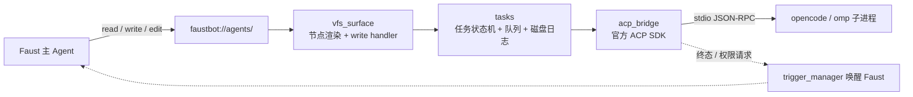

# Agent 通信 Agent Communicate

让 Faust 作为 **ACP 客户端**把编码任务外包给本机的外部编码 Agent（opencode / omp 等），
并取回结果、观察过程、裁决权限。

> **不新增任何工具**：全部能力经 `read` / `write` / `edit` 操作 `faustbot://agents/` 暴露（仓库的 VFS 优先原则）。
> **外部 Agent 不是沙箱**：它是本机子进程，拥有与 FaustBot 相同的用户权限，能自己读写文件、执行命令。
> 我们不声明 `fs` / `terminal` 客户端能力，那只是不做透传与观测，**不构成 OS 级隔离**。

## 它是怎么工作的



- 协议层**不自研**：用官方 `agent-client-protocol==0.12.1`（pin 版本，`requirements.txt` 已声明）。
  导入失败 = 插件加载失败并可见，**不会静默降级**。
- **纯异步**：提交立即返回 task id，绝不阻塞 agent turn；`read` 永不触发外部 I/O。
- 每个 Agent 一个进程、一个活跃 session、一条**串行队列**（默认上限 5，满即拒绝）；不同 Agent 并行。
- 进程**懒启动**，空闲 `idle_ttl_sec`（默认 900s）后关进程但保留 sessionId。

## VFS 节点（`faustbot://agents/`）

| 路径 | 读 | 写 | search |
|---|---|---|---|
| `agents/index.md` | 一行一 Agent | — | **是** |
| `agents/discover.md` | 探测结论与原因 | — | 否 |
| `agents/{name}/status.md` | 进程/session/阶段/队列/最近错误/可用命令 | — | 否 |
| `agents/{name}/submit` | 用法 + 信封 schema + 上次回执 | **提交任务** | 否 |
| `agents/{name}/config.json` | 当前会话的动态配置项与合法取值 | — | 否 |
| `agents/{name}/sessions.md` | 可续历史会话（缓存快照） | — | 否 |
| `agents/{name}/tasks.md` | 一行一任务 | — | **是** |
| `agents/{name}/tasks/{id}/result.md` | 终态回复 | — | **是** |
| `agents/{name}/tasks/{id}/output.md` | 正文累积 | — | 否 |
| `agents/{name}/tasks/{id}/events.md` | 事件流（思考/工具/权限） | — | 否 |
| `agents/{name}/permissions.md` | 待决权限列表 | — | 否 |
| `agents/{name}/permissions/{rid}.md` | 请求详情 | **裁决** | 否 |
| `agents/{name}/cancel` / `close` | 状态 | 取消任务 / 关进程 | 否 |
| `/plugins/agent-communicate.md` | 本插件的 VFS 入口说明 | — | **是** |

除 `index.md` / `tasks.md` / `result.md` 外一律 `should_be_included_in_search=False`：
`search` 会执行 symbolic 函数，绝不能让一次搜索拉起外部进程。

## 提交信封

```json
{
  "prompt": "把 backend/routes/chat.py 里那段重试逻辑抽成函数并跑测试",
  "cwd": "D:/dev/faustbot/faust",
  "session": "reuse",
  "notify": "batched",
  "config": {"mode": "plan"},
  "timeout_sec": 1800
}
```

也可以直接写纯文本（非 JSON 对象的内容整体视为 `prompt`）。
字段缺省：`cwd`=Agent 配置值、`session`=`reuse`、`notify`=`batched`、`config`=`{}`、`timeout_sec`=Agent 配置值。
未知字段忽略并在回执提示；`config` 里的未知 id 会报错并列出合法值（**不猜测**）。

提交后 write 工具输出会带一行 ACK：

```
已写入 faustbot://agents/opencode/submit (168 bytes)
↳ 已提交 task_7（session=reuse, 状态=排队中, 队列 1/5）
  结果读取：faustbot://agents/opencode/tasks/task_7/result.md
```

## 权限升级

外部 Agent 请求权限 → 登记 `reqId` → 挂 `permissions/{rid}.md` → 以 `normal` 触发器唤醒 Faust（**不抢占当前 turn**）
→ 有界等待 `permission_timeout_sec`（默认 300s）。裁决写入：

```json
{"outcome": "allow", "scope": "once", "reason": "只改仓库内文件"}
```

`allow`/`deny` 按 ACP option 的 `kind` 前缀映射到 `allow_*` / `reject_*`；
`reason` **只做本地留痕**（ACP 应答体没有这个字段，无法回传）。
超时或无人应答 → 执行默认动作（默认**拒绝**）并记入事件流，**绝不静默放行**；迟到的裁决不会改变已发出的应答。

## 自动探测

只认两项候选（v1 决议）：`opencode acp`、`omp acp`。
探测 = `PATH` 查找 + `<cmd> --help` 静态校验（≤5s），**绝不跑活握手**（omp 的 `session/new` 实测 >50s 无响应，
会拖死插件加载路径）。结果缓存于插件 GLOBAL storage，TTL `discover_cache_ttl_sec`（默认 3600s）。

明确**不**自动注册：`claude`（无 `acp` 子命令，需额外适配器）、`codex`（走 MCP）、`gemini`（需实验开关）。
要接就在插件配置的 `agents` 里手填命令。

## 已知限制

- **omp 很慢**：`session/new` 可达数十秒；每 Agent 独立超时，超时会如实写进任务与 `status.md`。
- **`terminal/*` 静默返回 null**：ACP SDK 把 terminal 路由注册为"可选、默认 null"，
  外部 Agent 会拿到 `null` 而不是明确拒绝；我们会在 `events.md` 记一行"收到未声明的 terminal 调用"。
  `fs/*` 不同：会给明确的 `method_not_found`。
- **`config.json` 需要先有会话**：配置项来自 `session/new` 的 `configOptions`，且会随会话动态变化
  （实测切换模型后会多出 `effort`）。想改配置直接在 `submit` 里带 `config`。
- **插件重载会打断在跑任务**：恢复时非终态任务一律改写为 `interrupted` 并注明原因，**不伪造完成**。

## 前端

配置中心 → 插件页「Agent 通信」：Agent 启停与会话管理、任务队列与历史、**待决权限直接批准/拒绝（含倒计时）**、
agents 表格化编辑、探测结果同步，以及当前任务的实时输出（SSE）。

## 相关文档

- 规格：[docs/agent-communicate-spec.md](../agent-communicate-spec.md)
- 实施计划：[docs/superpowers/plans/2026-10-05-agent-communicate.md](../superpowers/plans/2026-10-05-agent-communicate.md)
- 使用手册（Agent 视角）：`skill://agent-communicate/SKILL.md`
