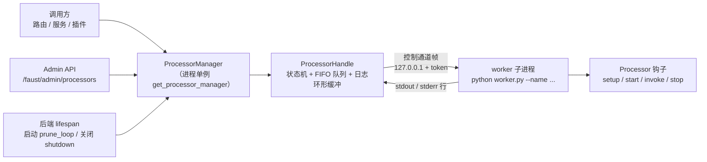
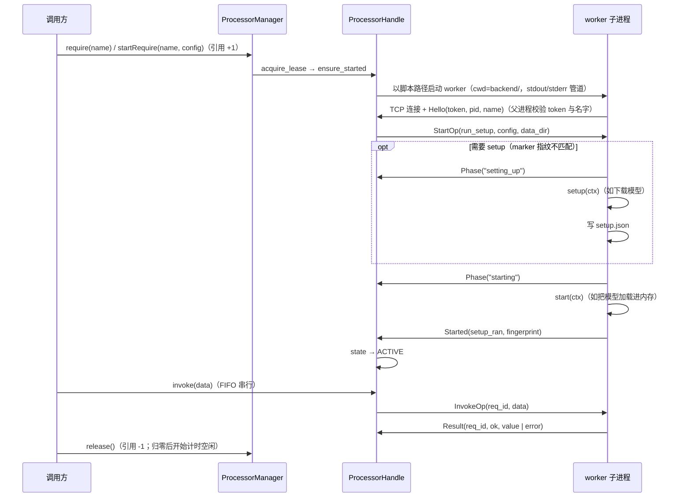
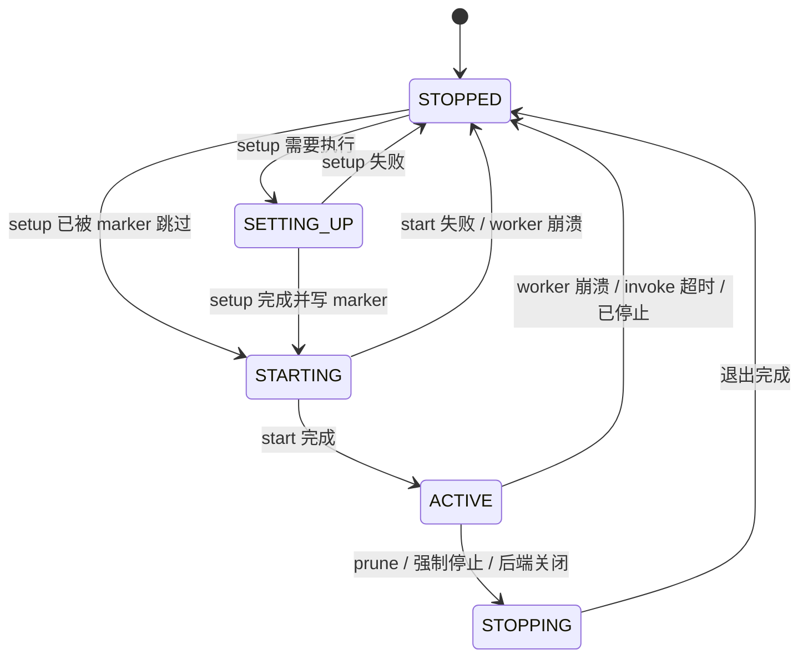
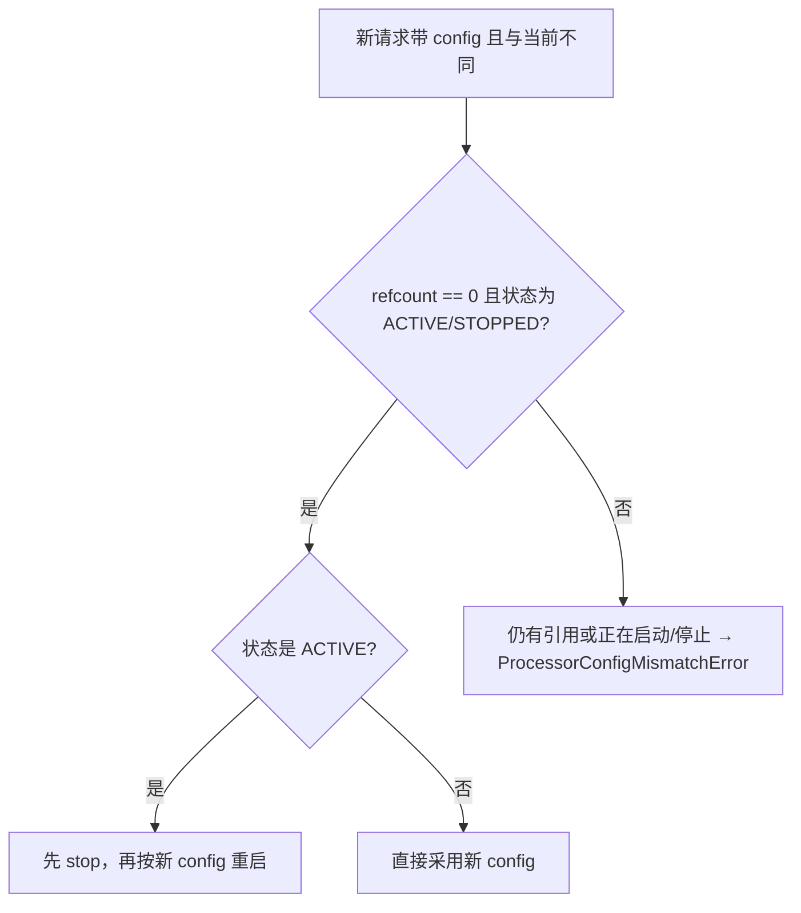

# Processor 机制（子进程计算任务）

Processor 是 FaustBot 里承载**重计算**的受管子进程：VAD、OCR 这类需要 torch / easyocr、动辄数百 MB 内存或显存的活，跑在独立 worker 进程里，主进程只负责**引用计数**与**转发调用**，空闲时自动回收 worker 以释放内存/显存。

代码位置：`backend/faust_backend/processors/`。

> 这是为了引入更多LLM推理等计算类功能的提前准备

## 目录

- [它解决什么问题](#它解决什么问题)
- [架构](#架构)
- [状态机](#状态机)
- [调用方用法（API）](#调用方用法api)
- [调用语义与并发](#调用语义与并发)
- [空闲回收（prune）](#空闲回收prune)
- [编写一个新的 Processor](#编写一个新的-processor)
- [数据目录与 setup marker](#数据目录与-setup-marker)
- [内置 Processor](#内置-processor)
- [在插件中注册 Processor](#在插件中注册-processor)
- [日志与排查](#日志与排查)
- [管理接口（Admin API）](#管理接口admin-api)
- [配置项](#配置项)
- [开发与测试](#开发与测试)
- [边界与非目标](#边界与非目标)

## 它解决什么问题

| 痛点                                        | Processor 的做法                                                                                                         |
| ----------------------------------------- | --------------------------------------------------------------------------------------------------------------------- |
| 主进程被 torch / easyocr 常驻占用数百 MB~数 GB 内存与显存 | VAD/OCR 的 torch / easyocr 只在 worker 钩子内 `import`，主进程导入链不加载它们（`import torch` / `import easyocr` 在 `sys.modules` 里都查不到） |
| 模型加载很慢，但只在偶尔用到                            | worker 常驻复用（一个名字 = 一个子进程），模型只加载一次                                                                                     |
| 长时间没人用却一直占着内存                             | 引用计数归零且空闲超过阈值后 `prune` 回收 worker                                                                                      |
| 依赖缺失导致整个后端起不来                             | setup/start 失败只让该 Processor 不可用，错误沿 `ProcessorStartError` 明确抛出并落到日志                                                   |

设计要点：

- **一个名字 = 一个子进程**。名字由 Processor 类的 `NAME` 决定，全局唯一（内置与插件共用同一注册表）。
- **控制通道**：父进程 `asyncio.start_server` 在 `127.0.0.1:0` 开一次性端口，worker 用「4 字节大端长度 + pickle」帧回连；不对外开放端口。
- **日志不走控制通道的 stdout**：torch / easyocr 会往 stdout 打印，因此 stdout/stderr 单独按行采集，`ctx.log()` 走帧。
- **错误不静默**：任何失败都会抛异常、写 ERROR 日志，或两者都有。

## 架构



启动 / 调用时序：



帧类型（`processors/protocol.py`，单帧上限 `MAX_FRAME_BYTES` = 256 MiB）：

| 方向    | 帧                                      | 说明                              |
| ----- | -------------------------------------- | ------------------------------- |
| 父 → 子 | `StartOp(run_setup, config, data_dir)` | 请求启动；`data_dir` 由**父进程**解析后下发   |
| 父 → 子 | `InvokeOp(req_id, data)`               | 一次计算（`req_id` 父进程单调递增）          |
| 父 → 子 | `StopOp()`                             | 优雅停止                            |
| 子 → 父 | `Hello(token, pid, name)`              | 握手首帧，token/名字必须匹配               |
| 子 → 父 | `Phase(phase)`                         | `setting_up` / `starting`       |
| 子 → 父 | `Started(setup_ran, fingerprint)`      | 已进入 ACTIVE                      |
| 子 → 父 | `StartFailed(error)`                   | setup/start 失败，worker 即将退出      |
| 子 → 父 | `Result(req_id, ok, value, error)`     | `InvokeOp` 应答                   |
| 子 → 父 | `LogMsg(ts, level, message, source)`   | `ctx.log` 产生的日志（`source="ctx"`） |

worker 的自我保护与退出码：父进程 PID 每 3s 探测一次，父进程消失则 `os._exit(3)`；初始化失败退出码 2，控制帧解码失败退出码 4，正常退出 0。

## 状态机



| 状态     | 含义                                     | `state` 取值   |
| ------ | -------------------------------------- | ------------ |
| 未启动    | 无 worker 进程                            | `STOPPED`    |
| 一次性初始化 | 正在跑 `setup()`（下载/校验模型）                 | `SETTING_UP` |
| 进程内初始化 | 正在跑 `start()`（加载模型进内存）                 | `STARTING`   |
| 可调用    | 可 `invoke()`                           | `ACTIVE`     |
| 停止中    | 已发 `StopOp`，等待退出（超时后 terminate → kill） | `STOPPING`   |

`phase` 字段同时记录 worker 最近上报的 `setting_up` / `starting`，用于区分「正在 setup」还是「正在 start」。

## 调用方用法（API）

```python
from faust_backend.processors import get_processor_manager

manager = get_processor_manager()

# 写法一：async with（进入时引用 +1 并触发启动，退出时自动释放）
async with manager.require("OCR", requirer="ui_operator", config={"langs": ["ch_sim", "en"], "gpu": False}) as lease:
    await lease.wait_until_ready()          # 等 ACTIVE（首次可能要下载/加载模型）
    items = await lease.invoke({"image": screenshot_array, "detail": 1})

# 写法二：长生命周期持有（例如 WebSocket 连接期间）
lease = await manager.startRequire("VAD", requirer=f"vad_ws:{id(websocket)}")
try:
    await lease.wait_until_ready()
    result = await lease.invoke({"audio": frame})
finally:
    lease.release()

# 写法三：配对 API（谁 startRequire、谁 endRequire）
lease = await manager.startRequire("VAD", requirer="my_feature")
await manager.endRequire("VAD", "my_feature")   # 释放该 requirer 最早的一个未释放引用
```

### `ProcessorManager`

| 方法                                                   | 说明                                                                             |
| ---------------------------------------------------- | ------------------------------------------------------------------------------ |
| `handle(name)`                                       | 取该 Processor 的状态对象 `ProcessorHandle`（按需创建）；名字未注册抛 `ProcessorNotFoundError`     |
| `require(name, requirer, *, config=None)`            | 返回**尚未获取**的 `ProcessorLease`；本身不启动进程、不计数——`acquire()` 或 `async with` 进入时才引用 +1 |
| `await startRequire(name, requirer, *, config=None)` | 立即 acquire 并返回已持有的 lease（等价 `await require(...).acquire()`）                    |
| `await endRequire(name, requirer)`                   | 释放该 `requirer` **最早**的一个未释放 lease；无匹配抛 `ProcessorLeaseError`                   |
| `status()`                                           | 所有已注册 Processor 的状态快照列表                                                        |
| `await prune(timeout=37.0, whitelist=None)`          | 回收空闲 Processor，返回 `PruneReport`                                                |
| `await prune_loop()`                                 | 后台回收循环（由后端 lifespan 启动；`PROCESSOR_PRUNE_INTERVAL=0` 时禁用但继续等待配置热改）              |
| `await stop(name)`                                   | **忽略引用计数**强制停止（写日志说明还有哪些持有者），管理用途                                              |
| `await shutdown()`                                   | 后端关闭时调用：忽略引用计数停止全部 Processor 并等待回收                                             |

`requirer` 是「谁在用」的标识，建议带上下文，例如 `vad_ws:1234`、`ui_operator`、`chat`；它只用于日志、`holders` 统计与 `prune` 判定。

### `ProcessorLease`

| 成员                                      | 说明                                                                           |
| --------------------------------------- | ---------------------------------------------------------------------------- |
| `await acquire()`                       | 登记引用并触发启动；重复 acquire / 已 release 后复用抛 `ProcessorLeaseError`                  |
| `release()`                             | 释放引用；未 acquire 就 release、重复 release 抛 `ProcessorLeaseError`                  |
| `async with`                            | `__aenter__` = `acquire()`，`__aexit__` = `release()`                         |
| `await wait_until_ready(timeout=None)`  | 等 ACTIVE；启动失败/崩溃抛 `ProcessorStartError`，超时抛 `ProcessorTimeoutError`          |
| `await invoke(data, *, timeout=None)`   | 一次计算调用（同 Processor 内 FIFO 串行）；`timeout` 缺省用类的 `INVOKE_TIMEOUT`（`None` = 不限时） |
| `await get_log(level=None, limit=None)` | 读该 Processor 的日志缓冲（最新在前；`level` 表示最低等级）                                      |

### `ProcessorHandle`

| 成员                                                                               | 说明                                                                   |
| -------------------------------------------------------------------------------- | -------------------------------------------------------------------- |
| `state` / `phase`                                                                | 状态机取值 / worker 上报阶段                                                  |
| `pid` / `pid_alive`                                                              | worker PID / 进程是否存活                                                  |
| `refcount` / `holders`                                                           | 未释放引用总数 / 按 `requirer` 分类计数                                          |
| `busy`                                                                           | 是否有在途或排队的 `invoke`（`prune` 用）                                        |
| `last_error`                                                                     | 最近一次失败原因（会**追加**而非覆盖，例如 `invoke 超时（0.7s）；worker exited with code 1`） |
| `config` / `fingerprint`                                                         | 当前生效 config / setup 指纹                                               |
| `invokes_total` / `invokes_failed` / `invokes_cancelled` / `last_invoke_seconds` | 调用统计                                                                 |
| `status()`                                                                       | 状态快照字典（见下表）                                                          |
| `await get_log(level=None, limit=None)`                                          | 读日志缓冲                                                                |
| `await stop(reason="manual")`                                                    | 停止 worker（等 `StopOp` → terminate → kill）                             |

`status()` 返回字段：`name`、`owner`、`state`、`phase`、`pid`、`pid_alive`、`last_error`、`refcount`、`holders`、`queue_depth`、`idle_seconds`、`uptime_seconds`、`setup_done`、`fingerprint`、`config`、`invokes_total`、`invokes_failed`、`invokes_cancelled`、`last_invoke_seconds`。

### 异常层级（`processors/errors.py`）

| 异常                             | 触发时机                                                            |
| ------------------------------ | --------------------------------------------------------------- |
| `ProcessorError`               | 基类                                                              |
| `ProcessorNotFoundError`       | 名字未在注册表中登记                                                      |
| `ProcessorStartError`          | setup/start 失败、父进程握手失败，或等待就绪期间 worker 崩溃（带 `last_error`、`logs`） |
| `ProcessorNotReadyError`       | 非 ACTIVE 状态下调用 `invoke`                                         |
| `ProcessorTimeoutError`        | setup/start/stop/invoke 超时（带 `phase`）                           |
| `ProcessorCrashedError`        | worker 意外退出导致在途/排队请求失败（带 `exit_code`）                           |
| `ProcessorConfigMismatchError` | 仍有其它引用时，新请求的 config 与当前不一致                                      |
| `ProcessorInvokeError`         | `invoke` 在子进程内抛错（带 `error_type`、`traceback_text`）               |
| `ProcessorLeaseError`          | lease 重复 acquire/release、未持有就使用、`endRequire` 无匹配                |
| `ProcessorFrameError`          | 控制通道帧超限或编解码失败                                                   |

## 调用语义与并发

- **同一 Processor 内 FIFO 串行**：并发 `invoke` 按调用顺序排队，逐个下发（模型句柄通常非线程安全，串行是刻意的）。
- **不同 Processor 之间并行**：各自独立子进程，互不阻塞。
- **入参与返回值必须可 pickle**：走的是 pickle 帧，`numpy` 数组可以直接传（4K 截图约 25 MB，远低于 256 MiB 上限）。
- **config 规则**：



  首次带 config 引用时会记录该 config；之后若当前没有 config 则补上。**没人引用**时改 config 会重启 worker，**有人引用**时改 config 明确报错，不偷偷重启。

- **`invoke` 内部报错**：worker 存活，异常以 `ProcessorInvokeError` 抛给调用方（`error_type`、`traceback_text` 保留原始类型与堆栈）。
- **`invoke` 超时**：回收 worker（terminate → kill），抛 `ProcessorTimeoutError`，`last_error` 记为 `invoke 超时（...）`。
- **worker 崩溃**（`os._exit`、OOM、被强杀）：在途请求抛 `ProcessorCrashedError`，仍在排队的请求也会失败（`ProcessorCrashedError` 或 `ProcessorNotReadyError`），状态回 `STOPPED`；下次 `require`/`startRequire` 会重新拉起。
- **调用方取消**（`asyncio.CancelledError`）：计入 `invokes_cancelled`，**不杀 worker**。
- **下发失败**（控制通道已关）：异常抛给调用方，不会让调用方永远等待。
- **后端关闭**：`manager.shutdown()` 忽略引用计数停止全部 Processor，并在日志中报告是否有残留 worker。

## 空闲回收（prune）

判定条件（全部满足才回收）：`state != STOPPED`、`refcount == 0`、无在途/排队请求（`busy == False`）、空闲时长 ≥ `timeout`。

- 空闲时长从「最后一个引用释放且队列为空」的时刻算起（`idle_since`）。
- `prune(timeout, whitelist)`：`whitelist=None` 处理全部已注册 Processor；给了列表则只处理列表内名字，出现未注册名字直接抛 `ProcessorNotFoundError`（不静默忽略）。
- 返回 `PruneReport(timeout, items)`，`as_dict()` 形如：

```json
{"timeout": 0.0, "items": [{"name": "VAD", "action": "stopped", "reason": "idle 0.0s >= 0.0s"}]}
```

`action` 只有 `stopped` 与 `skipped`（`reason` 会写明原因：`already stopped` / `referenced by {...}` / `requests pending` / `idle 8.3s < 300.0s` / `stop failed: ...`）。

`prune_loop()` 每轮重新读一次配置，因此改配置**无需重启后端**。

## 编写一个新的 Processor

最简形态（下面这份放在 `backend/faust_backend/processors/builtin/my_text.py`，所以用相对导入）：

```python
from __future__ import annotations

from typing import Any

from ..base import Processor, ProcessorContext
from ..registry import processor


@processor("MY_TEXT")
class MyTextProcessor(Processor):
    NAME = "MY_TEXT"                 # 全局唯一；与内置/其它插件重名会在注册时直接报错
    DATA_DIR = None                  # None = <DATA_ROOT>/processors/MY_TEXT
    SETUP_VERSION = "1"              # 需要重跑 setup 时 bump
    SETUP_TIMEOUT = 300.0
    START_TIMEOUT = 120.0
    STOP_TIMEOUT = 15.0
    INVOKE_TIMEOUT = 60.0            # None = 不限时
    LOG_BUFFER = 500                 # 父进程日志环形缓冲条数

    def setup(self, ctx: ProcessorContext) -> None:
        """一次性耗时初始化（可选）：下载/校验模型。marker 命中时会被跳过。"""

    def start(self, ctx: ProcessorContext) -> None:
        """每次 worker 进程启动都要做的初始化（必填）：把模型加载进内存。"""
        ctx.log("模型已加载")

    def invoke(self, ctx: ProcessorContext, data: Any) -> Any:
        """一次计算（必填）。入参与返回值都要能被 pickle。"""
        return {"echo": data}

    def stop(self, ctx: ProcessorContext) -> None:
        """释放资源（可选）。"""
```

类属性参考：

| 属性               | 默认       | 说明                                                           |
| ---------------- | -------- | ------------------------------------------------------------ |
| `NAME`           | `""`     | 全局唯一名字（注册时校验）                                                |
| `DATA_DIR`       | `None`   | ProcessorData 目录覆盖值；`None` = `<DATA_ROOT>/processors/<NAME>` |
| `SETUP_VERSION`  | `"1"`    | 参与 setup 指纹；改它等于强制重跑 setup                                   |
| `SETUP_TIMEOUT`  | `1800.0` | `setup()` 允许耗时（父进程计时）                                        |
| `START_TIMEOUT`  | `300.0`  | `start()` 允许耗时                                               |
| `STOP_TIMEOUT`   | `15.0`   | 发送 `StopOp` 后等待退出的上限（之后 terminate → kill）                    |
| `INVOKE_TIMEOUT` | `None`   | 单次 `invoke()` 上限；`None` = 不限时                                |
| `LOG_BUFFER`     | `500`    | 父进程保留的日志条数                                                   |

方法：

| 方法                          | 必填    | 说明                                                   |
| --------------------------- | ----- | ---------------------------------------------------- |
| `setup(ctx)`                | 否     | 一次性初始化；跑完写 `setup.json` 指纹                           |
| `start(ctx)`                | **是** | 每次进程启动都执行；注册时会检查是否实现                                 |
| `invoke(ctx, data)`         | **是** | 一次计算；父进程 FIFO 串行调用                                   |
| `stop(ctx)`                 | 否     | 释放资源；失败只记日志、不阻断退出                                    |
| `setup_fingerprint(config)` | 否     | 默认返回 `SETUP_VERSION`；**config 会影响模型文件时必须覆写**（如按语言列表） |

`ProcessorContext`：

| 成员                                            | 说明                                               |
| --------------------------------------------- | ------------------------------------------------ |
| `name` / `data_dir` / `config`                | Processor 名 / 数据目录（`Path`）/ 本次启动下发的 config 快照    |
| `log(message, level="INFO")`                  | 上报日志（非字符串用 `str()` 化，`level` 会转大写）；进入统一日志树与父进程缓冲 |
| `read_marker()` / `write_marker(fingerprint)` | 读/写 setup marker                                 |

编写约束（务必遵守）：

1. **同步钩子**。四个钩子都是同步函数，worker 用 `asyncio.to_thread` 隔离，避免阻塞控制通道与日志发送。
2. **重依赖在钩子内 import**（`import torch` / `import easyocr` 放进 `setup`/`start`），保证主进程导入链干净。
3. **不要自己写日志文件**，用 `ctx.log()`；否则绕过统一日志树。
4. **入参/返回值可 pickle**。
5. **只用 `ctx.config` 与 `ctx.data_dir`**：不能依赖主进程状态（插件 Processor 尤其如此，worker 里没有主进程的运行时对象）。
6. **`setup` 幂等**：可能因指纹变化重跑；`start` 必须能在任何时刻独立完成初始化。
7. **一个名字一个实例**：不做单名字多实例，也不做请求优先级/抢占（明确的非目标）。

注册方式：

- **内置**：放在 `backend/faust_backend/processors/builtin/`，用 `@processor("NAME")` 装饰并在 `builtin/__init__.py` 里 import（`manager.py` 会 import `builtin` 触发注册）。
- **插件**：实现 `register_processors(ctx)` hook，见[在插件中注册 Processor](#在插件中注册-processor)。

## 数据目录与 setup marker

- 默认目录：`<DATA_ROOT>/processors/<NAME>`，即 `~/.faustbot/data/processors/<NAME>`。
- 覆盖：类属性 `DATA_DIR`（VAD 用它把数据留在原处——torch hub 缓存目录）。
- marker 文件：`<data_dir>/setup.json`，内容 `{"fingerprint": "...", "completed_at": "..."}`。
- 判定：`setup_fingerprint(config)` 与 marker 里的 `fingerprint` 不一致（或 marker 缺失/损坏）→ 本次启动跑 `setup()`。
- `status()["setup_done"]` 即该判断结果；`fingerprint` 字段是 worker 回传的本次指纹。
- marker 是「跳过 setup」的**唯一**依据：删掉 marker 或 bump `SETUP_VERSION` 都会重跑 setup。

## 内置 Processor

| 名字    | 用途                                   | 依赖              | 输入 → 输出                                                                                                            | 超时（setup/start/stop/invoke） | 数据/模型目录                                                                  |
| ----- | ------------------------------------ | --------------- | ------------------------------------------------------------------------------------------------------------------ | --------------------------- | ------------------------------------------------------------------------ |
| `VAD` | 语音活动检测（silero-vad，16 kHz / 512 采样/帧） | torch           | `{"audio": float32[512]}` → `{"probability": float, "is_speech": bool}`                                            | 900 / 120 / 15 / 10 s       | `backend/asr-hub/model/torch_hub`（与迁移前的 torch hub 布局一致）                  |
| `OCR` | 截图文字识别（easyocr）                      | easyocr + torch | `{"image": uint8[H,W,3\|4], "detail": 0\|1}` → `detail=1` 时 `[{"text", "confidence", "box"}]`，`detail=0` 时 `[str]` | 1800 / 300 / 20 / 120 s     | 模型 `~/.faustbot/models/easyocr`，marker `~/.faustbot/data/processors/OCR` |

VAD 常量（`processors/builtin/vad.py`）：`SAMPLE_RATE = 16000`、`WINDOW_SIZE = 512`、`VAD_THRESHOLD = 0.5`；`is_speech` 即 `probability > VAD_THRESHOLD`。

- 后端 `GET /faust/audio/vad/status` 保留旧字段（`is_loaded` / `is_running` / `active_connections` / `sample_rate` / `window_size` / `threshold` / `unavailable_reason`），并追加 `state` / `last_error` / `pid` / `refcount`。
- VAD 的 WebSocket（`/faust/audio/ws/vad`）**连接即持有引用**（`refcount` = 当前连接数）；worker 崩溃或被回收后会自动换新 lease 自愈；任何 `ProcessorError` 都回一条**带 `error` 字段**的降级帧（`{"is_speech": false, "probability": 0.0, "error": "..."}`）并进入 30s 退避——前端依赖 `error` 字段排除降级帧，避免污染 PTT 命中率统计。
- silero 模型的下载/校验逻辑由 `faust_backend/download_vad.py:ensure_vad_cache()` 统一提供，CI 脚本与 `VadProcessor.setup` 共用一份实现。
- OCR 的 `setup_fingerprint` 与语言绑定（`1:ch_sim|en`，语言排序后拼接），因此换语言会自动重跑 setup。
- `screenOCRTool`（`ui_operator` 插件）已改走 OCR Processor：截图留在主进程，识别交给子进程。

## 在插件中注册 Processor

```python
from faust_backend.plugin_system import PluginContext, hookimpl
from faust_backend.processors.base import Processor


class MyProcessor(Processor):
    NAME = "MY_PLUGIN_ECHO"

    def start(self, ctx):
        ctx.log("started")

    def invoke(self, ctx, data):
        return {"echo": data}


@hookimpl
def register_processors(self, ctx: PluginContext) -> list:
    return [MyProcessor]
```

运行期使用（插件自己或框架其它部分）：

```python
from faust_backend.processors import get_processor_manager

async with get_processor_manager().require("MY_PLUGIN_ECHO", requirer="my_plugin", config={"langs": ["en"]}) as lease:
    await lease.wait_until_ready()
    result = await lease.invoke({"text": "hello"})
```

行为与限制：

- 注册在插件**加载的最后一步**进行；注册之后只剩不会抛异常的收尾，因此加载失败不会留下「名字被占用、插件却没加载」的残留注册。
- 插件**卸载 / 热重载**时，框架调用 `unregister_owner(plugin_id)`：停止并摘除该插件名下的全部 Processor（忽略引用计数，写日志说明）。
- 名字全局唯一：与内置 Processor 或其它插件重名会导致该插件加载失败（错误出现在 reload 结果的 `errors` 里）。
- 插件入口模块必须能在**独立子进程**中导入（自包含）；子进程按 `NAME` 就地解析该类，不依赖主进程的注册代码。
- 详见[插件 API 参考](plugin-api-reference.md) 的 `register_processors` 一节。

## 日志与排查

- 三个来源：`ctx`（`ctx.log()`）、`stdout`、`stderr`（后两者按行采集，行首的 `ERROR:` / `WARNING:` 前缀会被识别为等级）。
- 父进程为每个 Processor 保留 `LOG_BUFFER`（默认 500）条环形缓冲，`get_log(level="ERROR")` 取最低等级过滤、最新在前；每条含 `ts` / `level` / `message` / `source`。
- 同时进入统一日志树，名字为 `faust.processor.<NAME>`（主进程日志文件位于仓库根的 `logs/faust.log`），因此 `ui_operator`、`VAD` 等的子进程日志和后端日志在同一处可查。
- 排查入口：`GET /faust/admin/processors/{name}`（带日志尾巴）、`handle.last_error`、`handle.status()`。

常见失败形态：

| 现象                                                     | 含义                                  | 处理                                    |
| ------------------------------------------------------ | ----------------------------------- | ------------------------------------- |
| `ProcessorStartError: ... 握手超时/校验失败` + 子进程输出           | worker 起不来或连不回来（异常信息里会带上子进程已有输出）    | 看 `logs` 字段里的 stderr                  |
| `ProcessorStartError: ... ValueError: ...`             | `setup`/`start` 抛错（例如依赖缺失、模型文件损坏）   | `last_error` 与 ERROR 日志里含完整 traceback |
| `ProcessorTimeoutError: ... invoke 超时（Ns）`             | 单次调用超过 `INVOKE_TIMEOUT`，worker 已被回收 | 调大 `INVOKE_TIMEOUT` 或排查模型性能           |
| `ProcessorCrashedError: ... worker exited with code N` | 子进程崩溃（`os._exit(7)` / OOM / 被强杀）    | 退出码与崩溃前日志一并记录在 `last_error`           |
| `ProcessorNotReadyError`                               | 在非 ACTIVE 时调用 `invoke`（被回收、崩溃、正在启动） | 重新 `require` 并 `wait_until_ready()`   |
| `ProcessorConfigMismatchError`                         | 有其它引用时请求了不同 config                  | 统一双方 config，或等引用归零后再切换                |

## 管理接口（Admin API）

| 方法   | 端点                                    | 说明                                                                           |
| ---- | ------------------------------------- | ---------------------------------------------------------------------------- |
| GET  | `/faust/admin/processors`             | 全部 Processor 状态；`?include_log=true` 附带最近 50 条日志                              |
| GET  | `/faust/admin/processors/{name}`      | 单个 Processor 状态 + 日志尾巴（`?include_log=false` 可关）；未注册返回 404                    |
| POST | `/faust/admin/processors/{name}/stop` | **强制停止**（忽略引用计数，日志会写明持有者）；未注册返回 404                                          |
| POST | `/faust/admin/processors/prune`       | 回收空闲 Processor；`?timeout=` 缺省取 `PROCESSOR_IDLE_TIMEOUT`，`?whitelist=` 逗号分隔名字 |

```bash
# 看全部状态
curl http://127.0.0.1:13900/faust/admin/processors

# 只看 VAD（含日志尾巴）
curl http://127.0.0.1:13900/faust/admin/processors/VAD

# 立即回收空闲的 VAD（timeout=0 表示不设空闲门槛）
curl -X POST "http://127.0.0.1:13900/faust/admin/processors/prune?timeout=0&whitelist=VAD"

# 强制停止（即使还有引用）
curl -X POST http://127.0.0.1:13900/faust/admin/processors/VAD/stop
```

> 这些接口只做本机管理，**不暴露给 Agent**：Processor 不注册为 Agent 工具（本机制的非目标之一）。

## 配置项

| 配置项                        | 默认    | 说明                                         |
| -------------------------- | ----- | ------------------------------------------ |
| `PROCESSOR_PRUNE_INTERVAL` | `30`  | 后台回收检查间隔（秒）。`0` = 禁用后台自动回收（仍可手动调 admin 接口） |
| `PROCESSOR_IDLE_TIMEOUT`   | `300` | 空闲超过该秒数且无人引用时回收 worker                     |

```json
{
  "PROCESSOR_PRUNE_INTERVAL": 30,
  "PROCESSOR_IDLE_TIMEOUT": 300
}
```

两个值都在 `faust_backend/config_loader.py` 以模块级大写全局暴露，`prune_loop` 每轮重新读取，改配置无需重启后端（`PROCESSOR_PRUNE_INTERVAL` 设为 `0` 同样即时生效）。详见[配置说明](configuration.md#高级重计算子进程processor回收)。

## 开发与测试

```bash
# 机制本身的测试（manager / 协议 / 注册表 / 基类 / 内置 VAD·OCR）
.runtime/python.exe -m pytest backend/tests/test_processor_manager.py -q

# 相关集成测试
.runtime/python.exe -m pytest backend/tests/test_vad_ws_lease.py -q            # VAD WS 的 lease / 降级 / 自愈
.runtime/python.exe -m pytest backend/tests/test_processor_plugins.py -q      # 插件注册与卸载
.runtime/python.exe -m pytest backend/tests/test_processor_admin_api.py -q    # admin 路由
.runtime/python.exe -m pytest backend/tests/test_ui_operator_ocr.py -q        # screenOCRTool 走 OCR Processor

# 全量
.runtime/python.exe -m pytest backend/tests -q
```

手工确认注册与状态（cwd = 仓库根）：

```bash
.runtime/python.exe -c "import sys; sys.path.insert(0,'backend'); from faust_backend.processors import get_processor_manager as g; print([(i['name'], i['owner'], i['state'], i['refcount']) for i in g().status()])"
```

> ⚠️ 注册是**导入驱动**的：内置 Processor 由 `manager.py` 导入 `processors.builtin` 时完成注册，插件 Processor 由 `register_plugin_processors` 完成。因此单独 `from faust_backend.processors.registry import registered_names` 只会看到空表——先导入 `get_processor_manager`（或其调用方）再查。

环境注意事项：

- **`.runtime` 是内嵌发行版**（带 `python311._pth`）：它忽略 `PYTHONPATH`，也不把 cwd / 脚本目录放进 `sys.path`。因此 worker **只能以脚本路径**启动（`python <repo>/backend/faust_backend/processors/worker.py ...`），由 `worker.py` 顶部自举 `sys.path`；任何 `import faust_backend...` 的 `python -c` 都需先 `sys.path.insert(0, 'backend')`。
- 新增依赖要写进 `requirements.txt`（本机制的实现本身未引入新依赖）。
- 子进程会继承父进程环境变量；控制通道只监听/连接 `127.0.0.1`。

## 边界与非目标

- **不做请求优先级、不做 invoke 抢占/协作式取消**：同一 Processor 严格 FIFO；需要并发就拆成不同名字。
- **不做单名字多实例**：一个名字 = 一个子进程、一个 `Processor` 实例。
- **不承载需要长期会话/回调的计算**：`invoke` 是一次请求-应答，结果必须可 pickle。
- **不迁移 ASR / TTS 的外部服务**：funasr、GPT-SoVITS 仍由 `service_manager.py` 以 `.bat` 服务方式管理。
- **不暴露给 Agent**：本机制不注册 Agent 工具（需要给 Agent 用的话，走插件工具调用 Processor，例如 `ui_operator` 的 `screenOCRTool`）。
- 控制通道的保护是「仅 loopback + 每次启动的随机 token」，不要把它当作可跨机使用的 RPC。
