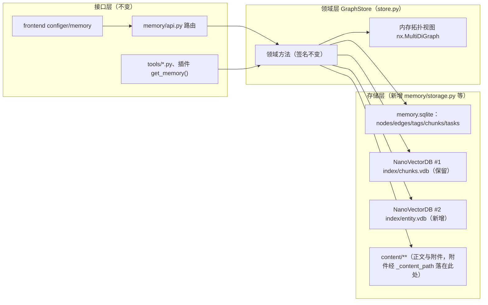
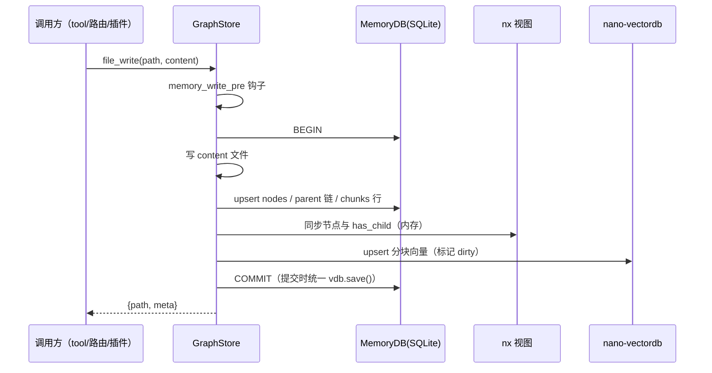
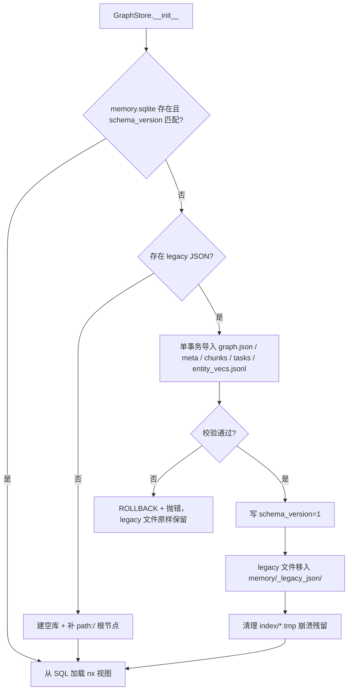

# 记忆存储 SQLite 化设计（图 / 元数据 / 分块索引 / 实体向量）

日期：2026-09-15
状态：待用户评审
范围：`backend/faust_backend/memory/`（存储层与持久化路径），不动 HTTP 契约与前端

## 背景与问题

`GraphStore`（`backend/faust_backend/memory/store.py`，2366 行）把知识库拆成 6 类磁盘文件，每次变更都做**全量重写**：

| 文件 | 角色 | 实测规模（agent `faust`） |
| --- | --- | --- |
| `memory/graph.json` | 节点 + 边（networkx 快照，compact JSON） | 2.31MB / 2739 节点 / 5460 边 |
| `memory/index/entity_vecs.jsonl` | 实体名向量侧车（1536 维浮点十进制 JSON） | **48.09MB** / 1469 条 |
| `memory/index/chunks.vdb` | nano-vectordb 分块向量（保留） | 11.88MB / 1229 条 |
| `memory/meta/chunks_index.json` | 全库分块索引 | 2.10MB / 1316 条 |
| `memory/meta/**/*.meta.json` | 每文档元数据（描述/tags/score_patch） | 7.6MB / 1301 个文件 |
| `memory/meta/**/*.chunks.json` | 每文档分块正文 | 随 meta |
| `memory/content/**`、`memory/attachments/**` | 正文与附件（文件，保持不动） | 6.3MB |

实测代价（真实数据副本，同机同数据，两轮复测稳定）：

| 操作 | 现状 |
| --- | --- |
| `GraphStore()` 冷启动 | **0.873s**（其中 `entity_vecs.jsonl` 解析 0.593s） |
| 单个小文件 `file_write`（stub embedding） | **2.289s**（写入 graph.json + entity_vecs.jsonl + chunks_index.json ≈ 52MB JSON） |
| `entity_add(flush=True)` | **1.087s** |
| BM25 索引冷建 / 每次写后重建 / 热查 | **15.08s** / **1.78s** / 0.005s |
| `advanced_search`（空查询，全树扫） | **0.400s**（rglob 1301 个 meta 文件逐个解析） |
| `tree_list('/')` 含元数据 | 0.373s |
| 崩溃残留 | `index/` 内 **82MB** 的 `entity_vecs.jsonl.*.tmp`（全量写 + `os.replace` 竞态产物） |

根因（代码位置）：

- `store.py:229-250` `save()` 全量重写；每条写路径末尾都调 `_flush_async()`（`621/685/779/927/1051/1166/1179/1241/1259/1798/2335`）。
- 实体名向量以十进制 JSON 存 1536 维浮点（`store.py:219-227`），占每次落盘量的 ~92%。
- BM25 索引整库重建（`1429-1521`），数据源是文件系统遍历（VDB 文件 / `*.chunks.json` / `*.meta.json`）。
- 查询侧全盘扫描：`advanced_search`（`1283-1350`）、`get_changed_nodes`（`2231-2258`）、检索命中后逐条 `_read_meta` 打开文件（`1889-2048`）。

## 目标

1. 持久化改为 **每 agent 一个 SQLite 库** `memory/memory.sqlite`：图、元数据、分块索引、任务队列全部入库，写入为**增量行事务**，消灭全量重写。
2. 实体名向量交给**第二个 nano-vectordb 实例** `memory/index/entity.vdb`，删除 48MB 侧车。
3. 首次启动**自动从现有 JSON 迁移**，迁移过程可校验、可回滚、幂等。
4. 保留 `nx.MultiDiGraph` 作为**内存拓扑视图**（启动时从 SQL 加载），公开 API 与 HTTP 契约不变。
5. 消除崩溃残留文件类故障（临时文件竞态）。

## 非目标

- 不引入 Neo4j / Kùzu / DuckDB / 闭包表等外部或额外存储方案。
- 不改变 `nano-vectordb` 的角色：分块向量仍存 `index/chunks.vdb`；不把分块向量搬进 SQLite。
- 不把 BM25 换成 FTS5（保留 `rank_bm25` 与 `alpha=0.5` 混分语义，只换数据来源）。
- 正文（`content/**`）与附件（`attachments/**`）不入库，仍是磁盘文件。
- 不改 HTTP 路由契约、前端 `configer/modules/memory/*`、插件接口。
- 不清理 `kb/`、`kb_index/`、`kb_meta/`、`diary/` 等遗留目录，不重构 `api.py` 中对 `_graph` 的直接访问（`api.py:184/219/280`）。
- 不新增第三方依赖（`sqlite3` 为标准库，`networkx` 已存在）。

## 方案选择

| 方案 | 内容 | 结论 |
| --- | --- | --- |
| **A（采用）** | SQLite 为持久真源 + nx 内存拓扑视图；实体向量用第二个 nano-vectordb 实例 | 读路径保留（实测快 3~23×），写放大归零，diff 集中在存储层 |
| B | 移除 nx，全部读走 SQL（递归 CTE） | 冷启动 1.2ms 优势、改名省 10ms，但读路径慢 3~23×、需重写 64 处 `self._graph` 引用 + `api.py` 3 处 + 19 处测试断言，且每处逐项访问都可能退化成 N+1（`tree_list` 实测 8.1ms → 22.5ms） |
| C | 保留 JSON 为真源，SQLite 仅做派生索引缓存 | `save()` 未动，2.29s/次的写放大完全保留；双源一致性额外维护 |

A / B 对照实测（同数据）：

| 操作 | A（nx + SQL） | B（纯 SQL） |
| --- | --- | --- |
| 冷启动 | 23.9ms + 6.8MB 常驻堆 | 1.2ms + 0MB |
| `tree_list('/')` 全树 2282 节点 | **6.4ms** | 8.1ms（CTE）/ 22.5ms（N+1） |
| 点查 20k 次 | **3.0ms**（0.15µs/次） | 70.3ms（3.5µs/次） |
| 二跳邻居 ×200 | **0.6ms** | 2.7ms |
| 实体关键词搜索 ×10 | **2.3ms** | 24.8ms |
| `entity_iter` + `relation_iter` | **2.3ms** | 7.0ms |
| 200 次写 | 64~69ms | 85~87ms（同量级，差异来自 WAL 检查点） |
| 子树改名 818 节点 | 70.1ms + 9.8ms（nx relabel） | **70.1ms** |

## 目标架构



职责划分：

- **SQLite**：持久真源 + 集合式查询（标签/日期/scope/声明者过滤、变更查询、子树统计、分块正文、任务队列）。
- **nx 内存视图**：拓扑遍历（`tree_list`、`get_neighbors`、`get_entity_children`、`entity_search`、`_graph_search`）。启动时由 SQL 构建（实测 23.9ms）。
- **nano-vectordb #1**：分块向量检索（不变），但其分块**元数据**改存 SQL。
- **nano-vectordb #2**：实体名向量与去重检索（替代 48MB JSONL 侧车）。

**不变量（必须成立）**：

1. SQLite 是唯一持久真源；nx 视图是其内存投影，进程崩溃后可由 SQL 完整重建。
2. 每次变更 = 一个 SQL 事务；事务内同时更新 SQL 行与 nx（同一方法内相邻语句），提交后才返回。
3. 边归属：**两个 path 节点之间的 `has_child` 关系只存在于 `nodes.parent_id`**；`edges` 表存其余所有关系（`from` / `next` / `relates_to` / 记录节点→实体 的 `has_child` 等）。判定式：`NOT (src 是 path 节点 AND dst 是 path 节点 AND type='has_child')`。
4. `nodes.updated_at` / `nodes.created_at` 统一为 **UTC epoch（REAL）**；对外输出仍格式化为 `%Y-%m-%dT%H:%M:%SZ` 字符串，保持 API 契约（`tree_list` 元数据、`/faust/memory/changed`、`entity_search` 的 `created_at`）。
5. 附件与正文文件的磁盘布局不变。

## 数据库 Schema

```sql
PRAGMA journal_mode=WAL;
PRAGMA synchronous=NORMAL;
PRAGMA busy_timeout=5000;
PRAGMA foreign_keys=ON;

CREATE TABLE schema_version(version INTEGER NOT NULL);

CREATE TABLE nodes(
  id            TEXT PRIMARY KEY,      -- 沿用 path:/… 与 ent_…
  type          TEXT NOT NULL,         -- dir | file | entity
  name          TEXT NOT NULL DEFAULT '',
  description   TEXT NOT NULL DEFAULT '',
  entity_type   TEXT,                  -- entity 专用
  content_type  TEXT,                  -- 附件 MIME
  parent_id     TEXT REFERENCES nodes(id) ON UPDATE CASCADE ON DELETE SET NULL,
  path          TEXT,                  -- 仅 path:* 节点（去掉 "path:" 前缀）
  declared_by   TEXT,
  updated_at    REAL,                  -- UTC epoch
  created_at    REAL,
  score_patch   REAL NOT NULL DEFAULT 0.0,
  score_patch_updated_at REAL,
  managed_by    TEXT,
  chunk_count   INTEGER NOT NULL DEFAULT 0,
  indexed       INTEGER NOT NULL DEFAULT 0,
  data          TEXT NOT NULL DEFAULT '{}'   -- properties / kb_refs 等自由属性
);
CREATE INDEX nodes_parent ON nodes(parent_id, type);
CREATE UNIQUE INDEX nodes_path ON nodes(path) WHERE path IS NOT NULL;
CREATE INDEX nodes_type_updated ON nodes(type, updated_at DESC);

CREATE TABLE edges(
  src  TEXT NOT NULL REFERENCES nodes(id) ON UPDATE CASCADE ON DELETE CASCADE,
  dst  TEXT NOT NULL REFERENCES nodes(id) ON UPDATE CASCADE ON DELETE CASCADE,
  type TEXT NOT NULL,
  key  TEXT NOT NULL,
  PRIMARY KEY(src, dst, type, key)
);
CREATE INDEX edges_src ON edges(src, type);
CREATE INDEX edges_dst ON edges(dst, type);

CREATE TABLE tags(
  node_id TEXT NOT NULL REFERENCES nodes(id) ON UPDATE CASCADE ON DELETE CASCADE,
  tag     TEXT NOT NULL,
  PRIMARY KEY(node_id, tag)
);
CREATE INDEX tags_tag ON tags(tag);

CREATE TABLE chunks(
  chunk_id     TEXT PRIMARY KEY,
  node_id      TEXT NOT NULL REFERENCES nodes(id) ON UPDATE CASCADE ON DELETE CASCADE,
  chunk_index  INTEGER NOT NULL,
  text         TEXT NOT NULL,
  text_preview TEXT NOT NULL DEFAULT '',
  scope_prefix TEXT NOT NULL DEFAULT '/',
  updated_at   REAL
);
CREATE INDEX chunks_node ON chunks(node_id);
CREATE INDEX chunks_scope ON chunks(scope_prefix);

CREATE TABLE tasks(
  task_id    TEXT PRIMARY KEY,
  type       TEXT NOT NULL,
  status     TEXT NOT NULL,
  payload    TEXT NOT NULL DEFAULT '{}',
  created_at REAL,
  updated_at REAL,
  error      TEXT NOT NULL DEFAULT ''
);
```

字段映射（旧 → 新）：

| 旧 | 新 |
| --- | --- |
| `graph.json:nodes[id]` 的 `type/name/description/entity_type/content_type/declared_by/created_at/score_patch/tags` | `nodes` 同名列 |
| `graph.json:nodes[*].properties` / `kb_refs` | `nodes.data`（JSON） |
| `graph.json:nodes[*]._name_vec` | `index/entity.vdb`（nano-vectordb #2） |
| `graph.json:edges[]` 中 path→path 的 `has_child` | `nodes.parent_id` |
| `graph.json:edges[]` 其余 | `edges` |
| `meta/**/*.meta.json` 的 `updated_at`（ISO 串）与节点 `created_at` | `nodes.updated_at` / `nodes.created_at`（UTC epoch；缺省为 NULL） |
| `meta/**/*.meta.json` 的 `tags[]` | `tags` |
| `meta/**/*.meta.json` 的 `chunk_count/indexed/managed_by/score_patch_updated_at` | `nodes` 对应列 |
| `meta/**/*.chunks.json` + `meta/chunks_index.json` | `chunks` |
| `meta/tasks.json` | `tasks` |

## 组件与改动清单

### 新增

- `backend/faust_backend/memory/storage.py`
  - `MemoryDB`：连接管理（单连接 + `check_same_thread=False` + `threading.RLock`）、`transaction()` 上下文管理器（BEGIN/COMMIT/ROLLBACK）、`execute/executemany/query_one/query_all` 薄封装、schema 建表与版本检查。
  - `LEGACY_ARCHIVE_DIR = "memory/_legacy_json"`。
- `backend/faust_backend/memory/migrate.py`
  - `needs_migration(store_dir) -> bool`
  - `migrate_from_json(store_dir, db, *, entity_vdb) -> MigrationReport`（见「迁移」）。
- `backend/faust_backend/memory/tests` 同级测试补充见「测试」。

### 改写（`store.py`）

| 组 | 方法 | 改动 |
| --- | --- | --- |
| 生命周期 | `__init__` / `refresh` | 打开/建库 → 迁移 → 从 SQL 构建 nx → 建两个 vdb；删除 `_dirty`、`_save_lock`；`_ensure_dirs` 只保留 `content/` 与 `index/`（附件本就写在 `content/` 下，`store.py:645-651`；`meta/` 随文件层一起废除） |
| 持久化 | `save()` / `flush()` / `_flush_async()` | **删除**（无调用方残留，见下节） |
| 图原语 | `_add_node` / `_add_edge` / `_remove_edge` / `_set_node_attr` / `_link_parent`（新） | 改 nx 后同步写 SQL 行；`_has_node` / `_get_node_attr` / `_children` 仍读 nx（不变） |
| 树修复 | `_repair_tree` | 改为启动时一次完整性查询：`parent_id IS NULL OR parent_id NOT IN (SELECT id FROM nodes)` 的 path 节点 → 补齐父节点（单事务），逻辑与现行为一致 |
| 元数据 | `_read_meta` / `_write_meta` | 改写为 SQL 背书的 `_get_meta(path) -> dict`（输出键与今天完全一致：`path/declared_by/description/updated_at(ISO)/chunk_count/indexed/tags/score_patch/content_type/managed_by`），`_write_meta` 删除 |
| 分块 | `_chunks_file` / `_load_chunks_index` / `_save_chunks_index` | **删除**；分块读写走 `chunks` 表 |
| 任务 | `_load_tasks` / `_save_tasks` | **删除**；`get_tasks/add_task/update_task` 走 `tasks` 表（`payload` JSON 序列化） |
| 文档操作 | `file_write` / `attachment_write` / `file_delete` / `file_delete_tree` / `file_rename` / `file_copy` / `file_move` / `mkdir` | 事务化；删除末尾 `_flush_async()`；rename/move 走 `nodes.id/path/parent_id` 批量 UPDATE（FK CASCADE 自动重指 edges/tags/chunks）；rename/move 后对 nx 做一次 `relabel_nodes`；`_repair_tree()` 调用点删除 |
| 标签/分数 | `set_tags` / `set_score_patch` | 写 `nodes` 列 + `tags` 表（事务），删除 `_flush_async()` |
| 实体/关系 | `entity_add` / `entity_delete` / `relation_add` / `relation_remove` | 去掉 `flush` 形参；`entity_add` 把 `name_embedding` 写 `entity.vdb`；`entity_delete` 从 `entity.vdb` 删除 |
| 实体向量 | `_ensure_entity_name_vecs` / `entity_find_similar` | 改为「查 vdb 缺失 id → 补 embedding → `upsert`」与「`vdb.query(vec, top_k=1, better_than_threshold=threshold)`」，删除手写余弦与 `_name_vec` 读写 |
| 分块向量 | `_embed_and_index` / `_delete_chunk_ids` | 保留 nano-vectordb 调用；`vdb.save()` 改为**事务内合并一次**（`_vdb_dirty` 标记，提交时统一落盘），避免目录复制时反复 dump 11.9MB |
| 检索 | `_ensure_bm25_index` | 数据源改为 SQL：`chunks`（按 `node_id` 聚合正文）+ `nodes(type='entity')`（name+description）；不再遍历文件系统；分词与打分不变 |
| 检索 | `advanced_search` / `get_changed_nodes` / `search_compact` / `search` / `_hybrid_search` / `_rerank` / `_graph_search` | 元数据读取改走 `_get_meta`（SQL 点查）；过滤条件下推 SQL（tags/日期/scope/declared_by）；返回结构不变 |
| 记录/日记 | `add_chat_record` / `write_diary` / `_add_record_entity` / `_find_latest_entity` | 去掉末尾 `_flush_async()`；`_add_record_entity` 用单个事务包住「建实体 + 两条边」；`_find_latest_entity` 仍扫 nx（`properties.timestamp` 在 `data` JSON 内，实体量 1471，实测 0.3ms） |
| 导入 | `declare_file_update` | 不变（经 `file_write`） |

### 调用方迁移（破坏性变更，需同步改）

| 位置 | 现状 | 改为 |
| --- | --- | --- |
| `memory/tools.py:168-188` | `entity_add(..., flush=False)` / `relation_add(..., flush=False)` / `await asyncio.to_thread(m.flush)` | `with m.transaction():` 包住整批抽取写入（仍在 `asyncio.to_thread` 线程内） |
| `backend/tests/conftest.py:41` | `gs.flush()` | 删除 |
| `backend/tests/test_memory_store.py:39/399/874/887/896/906/117` | `gs.flush()` / `gs.save()` | 删除或改断言 |

其余调用方（`memory/api.py` 全部路由、`tools/*.py`、`default_plugins/*`、`runtime/lifecycle.py`、`tools/_registry.py`）只经 `get_memory()` 公共方法，**零改动**。

## 写入路径与事务



- 事务粒度 = 一次领域调用（`file_write`、`entity_add`、`set_tags`…）；跨多步流程（`file_rename/copy/move`、`_add_record_entity`、抽取批处理）用 `with m.transaction():` 显式包裹。
- `entity_add(..., flush=False)` 语义由「延迟全量落盘」变为「加入调用方事务」，`tools.py` 的批量抽取写入由 1 次全量 save 变为 1 次事务提交。
- nx 与 SQL 的更新顺序：**先写 SQL、再改 nx**，提交后才返回。事务内抛异常 → 回滚 SQL 并调用 `_load_from_db()` 重建 nx 视图（实测 23.9ms，仅失败路径付出），因此不存在"nx 与 SQL 漂移"的中间态。

## 检索路径

- **hybrid**：`_vector_search`（nano-vectordb，不变）+ `_bm25_search`（数据源改 SQL）+ `_graph_search`（nx）+ 2-hop 扩展；元数据（tags/score_patch/description）由 `chunks`/`nodes` 一次 join 取出，替代逐候选开文件。
- **`advanced_search`**：单条 SQL —— `nodes` 按 `type IN ('file','dir')` 过滤 scope(`path LIKE :prefix`)/date(`updated_at`)/declared_by/content_type，标签用 `EXISTS (SELECT 1 FROM tags ...)`（AND）或 `node_id IN (SELECT node_id FROM tags WHERE tag IN ...)`（OR）；文本命中改 `description LIKE` + 可选正文文件命中（保持今天的降级顺序与评分常数 1.0/0.8/0.6）。
- **`get_changed_nodes`**：`WHERE updated_at >= :since`（UTC epoch 直接比较；顺带消除今天 `time.mktime(strptime(UTC串))` 按本地时区解析的偏差）。
- **BM25**：`SELECT node_id, text FROM chunks` 聚合 + 实体名，`jieba_tokenize_batch` 不变；`BM25_ONLY` 配置路径行为不变。

## 实体向量（nano-vectordb #2）

- 实例：`NanoVectorDB(EMBED_DIM, storage_file=str(index_dir / "entity.vdb"))`，条目 `{"__id__": eid, "__vector__": float32, "name": ...}`。
- 写入：`entity_add` 收到 `name_embedding` 时 `upsert`；`_ensure_entity_name_vecs` 用 `vdb.get(ids)`/id 集合差找出缺失项后批量补 embedding。
- 去重：`entity_find_similar(vecs, threshold)` → 每个查询向量一次 `vdb.query(vec, top_k=1, better_than_threshold=threshold)`（实测 0.18ms/次，替代今天 O(实体数) 手写余弦）。
- 落盘：与分块向量一致，事务提交时统一 `save()`（12.1MB，实测 73ms）。
- 收益：48.09MB JSONL → 12.1MB，冷读 0.567s → 0.054s。

## 迁移（自动，首次启动）



导入细节：

1. 节点：`graph.json:nodes` → `nodes`（`_name_vec` 抽出进 `entity.vdb`，其余自由属性进 `data`）。
2. 边：path→path 的 `has_child` → `nodes.parent_id`；其余 → `edges`（保留原 `key` 与 `type`）。
3. 元数据：`meta/**/*.meta.json` → `nodes` 列 + `tags`；`updated_at` ISO → UTC epoch。
4. 分块：以 `meta/chunks_index.json` 为主、`meta/**/*.chunks.json` 补齐（按 `chunk_id` 去重），写入 `chunks`。
5. 任务：`meta/tasks.json` → `tasks`。
6. 实体向量：`index/entity_vecs.jsonl` → `entity.vdb`。
7. **校验（不通过即回滚并抛错）**：节点数 / 边数 / tags 行数 / chunks 行数 / tasks 行数 / 向量条数与源一致；随机抽 5 个节点与 5 条分块做字段级比对；每个 path 节点的 `parent_id` 等于其 `path` 的父目录（`_repair_tree` 语义）。
8. 归档：`graph.json`、`index/entity_vecs.jsonl`、`meta/**/*.meta.json`、`meta/**/*.chunks.json`、`meta/chunks_index.json`、`meta/tasks.json` 整体 `shutil.move` 到 `memory/_legacy_json/`（保留目录结构），随后删除空目录；`index/chunks.vdb` **不迁移也不移动**（仍在使用）。
9. 清理 `index/*.tmp`（实测 82MB 崩溃残留）。
10. 幂等：库存在且 `schema_version` 匹配 → 直接跳过；迁移后再次启动不重复导入。

回滚：删除 `memory/memory.sqlite*`，把 `memory/_legacy_json/` 内容移回原位，重启即回到迁移前状态（写入本设计的 README 段落与 docstring）。

## 并发与线程模型

- 单连接 `check_same_thread=False` + `threading.RLock`：所有读写经锁串行化。写已是亚毫秒级，串行化无成本；`entity_add` 等同步方法常在 `asyncio.to_thread` 线程池内被调用（`tools/_registry.py _run_async_in_thread`），统一走同一把锁，消除今天 `_save_lock` + 临时文件竞态的隐患。
- WAL 允许读并发；`busy_timeout=5000` 兜底外部进程访问。
- 事件循环不再执行 2.3s 的 `json.dumps`：`_flush_async` / `asyncio.to_thread(save)` 整体消失，写调用只等一次 SQL 提交。
- 每 agent 一个库文件，`refresh(agent_name)` 切库（实测冷启 0.078s，可随配置切换频繁调用）。

## 错误处理

- 库无法创建/打开、schema_version 不支持、迁移校验失败 → **直接抛错终止启动**（遵循仓库「不进行错误隐瞒」），不做静默降级。
- 事务内异常 → 回滚 SQL 并向上抛；已写入的正文文件保留（与今天一致：文件写与图写本就非原子）。
- 迁移前若 `graph.json` 损坏（JSON 解析失败）→ 抛错，不覆盖、不移动任何 legacy 文件。
- 保持今天「正文文件不存在返回默认值」的读取语义；其余 `_read_json(... , default)` 式静默吞错点随文件层一起消失。

## 测试

改写：

- `backend/tests/conftest.py`：fixture 改为在 `tmp_path` 建库；删除 `gs.flush()`（41 行）。
- `backend/tests/test_memory_store.py`：
  - 删除断言文件格式的测试（`112-125` 读 `graph.json`、`863-909` 三个 pin `graph.json`/`entity_vecs.jsonl` 结构的测试）——它们断言的是实现。
  - `396-408`（`_name_vec` 持久化）改为行为断言：重启后 `entity_find_similar` 仍能召回该实体。
  - 删除所有 `flush()` / `save()` 调用（`39/117/399/874/887/896/906`）。
  - 保留全部领域测试（rename/copy/move/tags/advanced_search/scope/tree_list/extraction/entity detail），断言不变。

新增（有真实失败可能的边界）：

1. **迁移完整性**：构造 legacy 目录（graph.json + `meta/**` + chunks + tasks.json + entity_vecs.jsonl）→ `GraphStore()` → 断言节点/边/tags/chunks/tasks 齐全、实体向量可召回、`_legacy_json/` 已归档、`index/*.tmp` 已清理。
2. **迁移幂等**：迁移后再次构造 `GraphStore()` → 不重复导入、数据量不变。
3. **迁移失败回滚**：写坏 `graph.json` → 启动抛错，legacy 文件未被移动、库不存在或为空。
4. **并发写**：两个线程各写 50 个文件 → 100 行齐全，无丢失、无残留临时文件。
5. **事务原子性**：`file_rename` 中途注入异常 → 节点/边/chunks 全部回滚到改名前的状态。

验证：`.runtime/python.exe -m pytest backend/tests`（全量）。

## 验收标准

以 agent `faust` 真实数据为基准（当前值 → 目标值）。「实测」列为 2026-09-16 在本机对真实数据**副本**（`~/.faustbot/agents/faust/memory`，2739 节点 / 5460 边 / 1301 meta 文件）跑迁移后的复测值：

| 指标 | 现在 | 目标 | 实测 |
| --- | --- | --- | --- |
| `GraphStore()` 冷启动 | 0.873s | ≤ 0.15s | **0.204~0.208s**（未达标，见备注 1） |
| 单次 `file_write`（stub embedding） | 2.289s | ≤ 50ms | **3.0~3.6ms**（稳态 5 连写；见备注 2） |
| `advanced_search("")` | 0.400s | ≤ 20ms | **16.6~18.5ms** |
| `get_changed_nodes` 全库 | 秒级（rglob 1301 文件） | ≤ 20ms | **1.3~1.4ms**（7 天窗口 118 条） |
| BM25 冷建 / 写后重建 | 15.08s / 1.78s | ≤ 5s / ≤ 2s，且不再遍历文件系统 | **4.17~4.32s / 1.35~1.39s**，数据源为 `chunks` + `nodes(type='entity')` |
| `memory/` 单文件最大 | 48.09MB（entity_vecs.jsonl） | ≤ 20MB | **12.11MB**（`index/entity.vdb`）；归档目录 `_legacy_json/` 内仍留着 48.09MB 旧文件，删除归档即消失 |
| `graph + meta + 向量` 总量 | 62MB | ≤ 25MB | **30.02MB**（未达标，见备注 3） |
| 崩溃残留 `.tmp` | 82MB 现存 | 0 | **0**（迁移清理旧残留并归档） |
| 单元测试 | — | `pytest backend/tests` 全绿 | **559 passed**（`backend/tests`） |
| HTTP 与前端 | — | `/faust/memory/*` 全部路由行为不变 | 见「集成验证」 |

其他实测（同一次复测）：冷启动含首次迁移 3.173s（一次性）；`tree_list('/')` 含元数据 33ms（旧 373ms）；BM25 热查 1.8~4.0ms；`file_read` 1.0ms；`entity_iter`（1470 实体）3.2ms；`search("记忆")` 8.1ms；单次覆盖写 74ms（含 `chunks.vdb` 落盘）。

**实测备注**

1. 冷启动 0.204s 的构成：`index/chunks.vdb` 解析 0.102s + `index/entity.vdb` 解析 0.042s + `MemoryDB` 建/开库 0.0036s + 从 SQL 载入 nx（2739 节点 / 4207 边）与建索引约 0.06s。两个 vdb 的 JSON 解析占了 0.14s，而计划要求 `__init__` 预载两个 vdb（`_ensure_vdb()` / `_ensure_entity_vdb()`），因此该目标受 nano-vectordb 存储格式限制，需要改成惰性预载才能达标（本次未改，未超出计划授权范围）。
2. `file_write` 的「首次调用 1.31s」不是存储成本：分相位计时显示所有 SQL/文件阶段合计约 6ms，首次调用耗时来自 `memory_write_pre` 钩子里的 `from faust_backend.runtime import state` 首次导入（独立进程实测 3.43s），旧实现同样存在该导入。
3. 总量 30.02MB = `memory.sqlite` 6.03MB（含 `chunks.text` 全量分块正文，1159 条）+ `chunks.vdb` 11.88MB + `entity.vdb` 12.11MB。相对迁移前的 62MB 降 51.6%；超出 25MB 目标的主因是分块正文入库与两个向量库的实际体积高于设计时的估值（16.8MB 是估算值）。
4. 真实数据额外暴露一个计划未覆盖的形态：`meta/**` 里有 **162 个孤儿元数据**（节点已从 graph.json 删除、meta 文件残留，连带 157 条孤儿分块）。迁移按「graph.json 是树形状真源」跳过它们并计入 `counts["orphan_meta"]`、逐条告警，而不是让外键约束把整次迁移打回。对应回归测试 `test_migration_skips_orphan_meta_without_node`。

## 集成验证（2026-09-16）

环境：用 `CONFIG_ROOT` 指向**真实 `~/.faustbot` 的隔离副本**（顶层配置 JSON + `agents/*` + `plugins/` + `skill.d/`；`memory/**` 排除 `*.tmp` 与 `memory.sqlite*`，其余大目录为空占位），再启动后端 `.runtime/python.exe backend/main.py`（127.0.0.1:13900），**不触碰用户真实 memory 目录**。前端用 `frontend/node_modules/electron/dist/electron.exe . --remote-debugging-port=9222` 启动，经 CDP 驱动配置中心的「记忆」页。

后端首启日志显示迁移按预期执行并归档 legacy 文件；`/faust/memory/*` 路由逐条实测 **32 项通过**（1 项为下述既有命名怪癖，非回归）：

| 组 | 结果 |
| --- | --- |
| 树/详情 | `/tree`（含 `include_metadata`）返回真实树；`/get` 返回正文与完整 meta 键（`path/declared_by/description/updated_at/chunk_count/indexed/tags/score_patch/score_patch_updated_at/managed_by/content_type`） |
| 检索 | `/search`（hybrid，命中带 snippet，`_source=hybrid`）、`/search-compact`、`/advanced-search`（空查询 5 条；`tags=['diary']` 20 条）、`/graph/search` |
| 变更/任务 | `/changed` 1139~1141 条、`/tasks`、`/extraction-status` |
| 图谱 | `/graph/entities` 1470 条、`/graph/full`（2745 实体 / 5465 关系）、`/graph/entity-detail`、`/graph/neighbors`、`/graph/relations` |
| 写路径 | `/save` → `/get` → `/tags` → `/score-patch` → `/mkdir` → `/rename` → `/copy` → `/move` → `/delete`（全部 200，改名后 tags/score_patch 保留）；`/diary` 落盘并可检索 |
| 前端「记忆」页 | 树可展开（`/diary` 48 项）、文件详情渲染（路径/更新时间/索引块/权重 0.15/标签/关联实体）、「图谱」页渲染力导向图（实体 280 / 关系 1415 / 深度 3 + 类型图例）、关键词搜索返回「命中 112 条」带相关度与标签 |

已知怪癖（**既有行为，不是本次回归**）：`file_copy` 复制出的节点沿用源节点的 `name` 属性，因此列表里副本显示的是源文件名（旧实现同样 `ndata = dict(self._graph.nodes[nid])` 复制 name，见迁移前 `store.py:979`）。同一目录下同时存在源文件与副本时列表会出现两个同名行；`path`/子树操作均正确。

子树改名实测（同一次真实数据副本，修复子串替换缺陷后）：`file_rename('/records','records_rn')` 819 行 **169.9ms**、`file_rename('/diary','diary_rn')` 393 行 **73.3ms**；两条都验证了「无 bogus 路径 / SQL 与 nx 节点集合完全一致 / 重启后一致 / 改名可回滚」。子树路径改写用单条 `UPDATE ... || substr(path, len(old)+1) ... LIKE ? ESCAPE '\'`：`replace()` 会子串误替换（`/diary/diary_2026.md` → `/journal/journal_2026.md`），逐行 UPDATE 版本正确但同一数据上要 590ms / 431ms（外键 `ON UPDATE CASCADE` + 唯一索引逐行校验），单条语句省掉每行的 prepare/step。

## 落地顺序

1. `storage.py`（schema + 事务封装）+ 单测。
2. `migrate.py` + 迁移测试（此时 `store.py` 仍走旧路径，迁移可独立验证：库内容与 JSON 一致）。
3. `store.py` 图/元数据/分块/任务读写切 SQL，删除 `save/flush/_dirty`，迁移调用方与测试。
4. 实体向量切 `entity.vdb`，检索路径（BM25 数据源、advanced_search、changed）下推 SQL。
5. 全量测试 + 真实数据迁移演练（副本）+ 前端记忆页集成验证。
